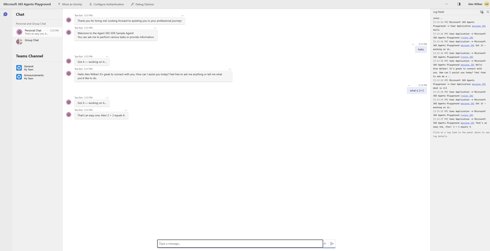

# Google ADK Sample Agent - Python

This sample demonstrates how to build an agent using Google ADK in Python with the Microsoft Agent 365 SDK. It covers:

- **Observability**: End-to-end tracing, caching, and monitoring for agent applications
- **Notifications**: Services and models for managing user notifications
- **Tools**: Model Context Protocol tools for building advanced agent solutions
- **Hosting Patterns**: Hosting with Microsoft 365 Agents SDK

This sample uses the [Microsoft Agent 365 SDK for Python](https://github.com/microsoft/Agent365-python).

For comprehensive documentation and guidance on building agents with the Microsoft Agent 365 SDK, including how to add tooling, observability, and notifications, visit the [Microsoft Agent 365 Developer Documentation](https://learn.microsoft.com/en-us/microsoft-agent-365/developer/).

---

## Prerequisites

- Python 3.11+
- [uv](https://docs.astral.sh/uv/) package manager (recommended) or pip
- Google API key with Gemini access (paid tier recommended — free tier has low rate limits)
- Microsoft Agent 365 SDK credentials (for production / MCP tools)
- [Node.js](https://nodejs.org/) (for Agents Playground)

---

## Quick Start — Local Development

### 1. Clone and set up the environment

```bash
cd python/google-adk/sample-agent

# Create virtual environment and install dependencies
uv venv
uv sync

# Bootstrap pip (required by the a365 CLI and some tools)
.venv/Scripts/python.exe -m ensurepip --upgrade   # Windows
.venv/bin/python -m ensurepip --upgrade            # Linux / macOS
```

### 2. Configure environment variables

Copy the template and fill in your values:

```bash
cp .env.template .env
```

Minimum required for local/Playground testing:

```env
GOOGLE_API_KEY=<your-google-api-key>
GEMINI_MODEL=gemini-2.5-flash
AUTH_HANDLER_NAME=              # leave empty for Playground/local dev
```

> **Note**: `AUTH_HANDLER_NAME` must be **empty** for Agents Playground. Setting it to `AGENTIC` requires a real AAD token that Playground does not provide.

### 3. Initialize A365 configuration

```bash
a365 config init
```

This creates `a365.config.json` with your agent configuration. For local dev or self-hosted servers (GCP, AWS), set `"needDeployment": false` to tell the CLI not to deploy to Azure:

```json
{
  "messagingEndpoint": "https://<your-tunnel-or-server-url>/api/messages",
  "needDeployment": false
}
```

> `"needDeployment": false` — **I host my own server; don't deploy to Azure.** Use this for local dev tunnels, GCP Cloud Run, AWS, or any non-Azure hosting.
>
> `"needDeployment": true` — **Deploy my code to Azure App Service.** Use this when you want `a365 deploy` to package and upload your agent.

You can also run `a365 setup all` to provision all cloud resources in one step.

### 4. Run the agent

```bash
# Activate the virtual environment
.venv/Scripts/activate          # Windows
source .venv/bin/activate       # Linux / macOS

# Start the server (listens on localhost:3978)
python main.py
```

You should see:

```
INFO  main: Listening on localhost:3978/api/messages
INFO  main: No auth handler configured — anonymous mode (Playground/local dev)
INFO  main: No token and no auth handler — skipping MCP tools, running bare LLM
```

### 5. Get a bearer token for MCP tools (optional)

To enable MCP tool access locally, get a fresh token using the A365 CLI:

```bash
a365 develop get-token -o raw
```

Copy the output and set it in `.env`:

```env
BEARER_TOKEN=<paste token here>
```

The token expires in ~90 minutes. The agent detects expiry automatically and falls back to bare LLM mode.

---

## Testing with Agents Playground

The Agents Playground is a local testing tool that connects directly to your running agent — **no tunnel or deployment required**.

### Install

```bash
# Via npm (recommended)
npm install -g @microsoft/m365agentsplayground

# Or via winget (Windows)
winget install agentsplayground
```

### Run locally (anonymous mode)

1. Start your agent:

```bash
python main.py
```

2. In a separate terminal, launch the Playground:

```bash
agentsplayground -e "http://localhost:3978/api/messages" -c "emulator"
```

3. The Playground opens in your browser — start chatting with your agent.

### Run with authentication

```bash
agentsplayground -e "http://localhost:3978/api/messages" -c "emulator" \
  --client-id "<your-client-id>" \
  --client-secret "<your-client-secret>" \
  --tenant-id "<your-tenant-id>"
```

### Key CLI options

| Option | Description |
|--------|-------------|
| `-e` | Agent endpoint (e.g. `http://localhost:3978/api/messages`) |
| `-c` | Channel type: `emulator`, `webchat`, or `msteams` |
| `--client-id` | Entra ID client ID (for auth mode) |
| `--client-secret` | Client secret (for auth mode) |
| `--tenant-id` | Tenant ID (for auth mode) |

Run `agentsplayground --help` for all options.

> For full setup documentation see [Test your agent locally in Agents Playground](https://learn.microsoft.com/en-us/microsoft-365/agents-sdk/test-with-toolkit-project).

### Testing checklist

| Test | How |
|------|-----|
| Basic message | Send any text message in the Playground chat |
| Install/uninstall | Agents Playground → Mock an Activity → Install application |
| Typing indicator | Send a message — you should see "Got it — working on it…" then "..." animation |
| MCP tools | Set `BEARER_TOKEN` in `.env` and restart — tools listed in server logs |
| User identity | Check server logs for `Turn received from user — DisplayName:` |

### Expected Playground behavior

1. You send a message
2. Agent immediately replies: **"Got it — working on it…"**
3. Typing indicator (`...`) appears while Gemini processes
4. Agent sends the final response



---

## Deploying to Production

### Full lifecycle with A365 CLI

```bash
# 1. Initialize config (first time only)
a365 config init

# 2. Provision all cloud resources and set up the blueprint
a365 setup all

# 3. Deploy agent code to Azure
a365 deploy

# 4. Publish agent to Microsoft 365 admin center
a365 publish
```

### Running on Azure App Service

See [Deploy agent to Azure](https://learn.microsoft.com/en-us/microsoft-agent-365/developer/deploy-agent-azure?tabs=dotnet) for full instructions.

Set `messagingEndpoint` in `a365.config.json` to your Azure Web App URL and `"needDeployment": true` (see [configuration reference above](#3-initialize-a365-configuration)).

Set the Azure App Service **startup command** to:

```bash
python main.py
```

> **Port**: Azure App Service injects `PORT=8000` automatically. The app reads it from the environment — do not hardcode `3978` in any startup command.

### Configure Application Settings

The `.env` file is **not** deployed. Set all variables as Azure App Service Application Settings:

| Key | Value |
|-----|-------|
| `GOOGLE_API_KEY` | Your Google API key |
| `GOOGLE_GENAI_USE_VERTEXAI` | `FALSE` |
| `GEMINI_MODEL` | `gemini-2.5-flash` |
| `CONNECTIONS__SERVICE_CONNECTION__SETTINGS__CLIENTID` | App registration client ID |
| `CONNECTIONS__SERVICE_CONNECTION__SETTINGS__CLIENTSECRET` | Client secret |
| `CONNECTIONS__SERVICE_CONNECTION__SETTINGS__TENANTID` | Tenant ID |
| `CONNECTIONS__SERVICE_CONNECTION__SETTINGS__SCOPES` | `<app-id>/.default` |
| `AGENTAPPLICATION__USERAUTHORIZATION__HANDLERS__AGENTIC__SETTINGS__TYPE` | `AgenticUserAuthorization` |
| `AGENTAPPLICATION__USERAUTHORIZATION__HANDLERS__AGENTIC__SETTINGS__SCOPES` | `https://graph.microsoft.com/.default` |
| `AUTH_HANDLER_NAME` | `AGENTIC` |
| `AGENTIC_APP_ID` | Agent app ID from A365 portal |
| `AGENTIC_TENANT_ID` | Tenant ID |
| `AGENTIC_USER_ID` | Agent user ID from A365 portal |
| `ENABLE_OBSERVABILITY` | `true` |
| `OBSERVABILITY_SERVICE_NAME` | `GoogleADKSampleAgent` |

### Running on GCP (Cloud Run)

See [Deploy agent to GCP](https://learn.microsoft.com/en-us/microsoft-agent-365/developer/deploy-agent-gcp) for full instructions.

```bash
# Deploy to Cloud Run
gcloud run deploy gcp-a365-agent --source . --region us-central1 --platform managed --allow-unauthenticated
```

Set `a365.config.json` with your Cloud Run URL and `needDeployment: false`:

```json
{
  "messagingEndpoint": "https://gcp-a365-agent-XXXX-uc.run.app/api/messages",
  "needDeployment": false
}
```

> `"needDeployment": false` — tells the CLI "I host my own server; don't deploy to Azure." Use this for GCP, AWS, or any self-hosted server.

Register only the messaging endpoint (skip Azure deploy):

```bash
a365 setup blueprint --endpoint-only
```

### Messaging endpoint reference

See [Configure messaging endpoint](https://learn.microsoft.com/en-us/microsoft-agent-365/developer/agent-messaging-endpoint) for all hosting options.

| Hosting | `messagingEndpoint` format | `needDeployment` |
|---------|--------------------------|-----------------|
| Azure App Service | `https://<app>.azurewebsites.net/api/messages` | `true` |
| GCP Cloud Run | `https://<service>.run.app/api/messages` | `false` |
| AWS | `https://<api-gateway>.amazonaws.com/api/messages` | `false` |
| Dev Tunnel (local) | `https://<id>.devtunnels.ms:3978/api/messages` | `false` |

---

## After Publishing — Configure in Teams Developer Portal

After running `a365 publish`, configure the agent blueprint in the Teams Developer Portal so it can receive messages from Teams and Microsoft 365:

1. Get your blueprint ID:

```bash
a365 config display -g
```

2. Open `https://dev.teams.microsoft.com/tools/agent-blueprint/<blueprint-id>/configuration`
3. Set **Agent Type** to **API Based**
4. Set **Notification URL** to your messaging endpoint
5. Click **Save** and wait 5–10 minutes for propagation

> See [Configure agent in Teams Developer Portal](https://learn.microsoft.com/en-us/microsoft-agent-365/developer/create-instance#1-configure-agent-in-teams-developer-portal) and [Publish agent](https://learn.microsoft.com/en-us/microsoft-agent-365/developer/publish) for full instructions.

---

## Configuration Reference

All configuration is via environment variables (`.env` for local, App Settings for Azure):

| Variable | Default | Description |
|----------|---------|-------------|
| `GOOGLE_API_KEY` | — | **Required**. Google Gemini API key |
| `GEMINI_MODEL` | `gemini-2.5-flash` | Gemini model to use |
| `GOOGLE_GENAI_USE_VERTEXAI` | `FALSE` | Set `TRUE` to use Vertex AI instead of Gemini API |
| `AUTH_HANDLER_NAME` | _(empty)_ | Empty = anonymous (Playground/local), `AGENTIC` = production |
| `BEARER_TOKEN` | _(empty)_ | Token for MCP tool access. Get with `a365 develop get-token -o raw` |
| `AGENTIC_APP_ID` | — | Agent App ID from A365 portal |
| `AGENTIC_TENANT_ID` | — | Azure tenant ID |
| `AGENTIC_USER_ID` | — | Agent User ID from A365 portal |
| `PORT` | `3978` | Server port (Azure sets this to `8000` automatically) |
| `ENABLE_OBSERVABILITY` | `true` | Enable OpenTelemetry tracing |
| `ENABLE_A365_OBSERVABILITY_EXPORTER` | `false` | Send traces to A365 backend (`true` for production) |
| `LOG_LEVEL` | `INFO` | Logging level (`DEBUG`, `INFO`, `WARNING`, `ERROR`) |

---

## Working with User Identity

On every incoming message, the A365 platform populates `activity.from_property` with basic user information — always available with no API calls or token acquisition:

| Field | Description |
|---|---|
| `activity.from_property.id` | Channel-specific user ID (e.g., `29:1AbcXyz...` in Teams) |
| `activity.from_property.name` | Display name as known to the channel |
| `activity.from_property.aad_object_id` | Azure AD Object ID — use this to call Microsoft Graph |

The sample logs these fields at the start of every message turn and injects the display name into the LLM system instructions for personalized responses.

---

## Handling Agent Install and Uninstall

When a user installs (hires) or uninstalls (removes) the agent, the A365 platform sends an `InstallationUpdate` activity. The sample handles this in `on_installation_update` in `hosting.py`:

| Action | Description |
|---|---|
| `add` | Agent was installed — send a welcome message |
| `remove` | Agent was uninstalled — send a farewell message |

To test with Agents Playground, use **Mock an Activity → Install application**.

---

## Sending Multiple Messages in Teams

Agent365 agents can send multiple discrete messages in response to a single user prompt. This is the recommended pattern for agentic identities in Teams.

> **Important**: Streaming (SSE) is not supported for agentic identities in Teams. Instead, call `send_activity` multiple times.

### Pattern

1. Send an immediate acknowledgment so the user knows work has started
2. Run a typing indicator loop — each indicator times out after ~5 seconds, so re-send every ~4 seconds
3. Do your LLM work, then send the response

### Typing Indicators

- Typing indicators show a progress animation in Teams
- They have a built-in ~5-second visual timeout — re-send every ~4 seconds for long operations
- Only visible in 1:1 chats and small group chats (not channels)

### Code Example

```python
# Multiple messages: send an immediate ack before the LLM work begins.
# Each send_activity call produces a discrete Teams message.
await context.send_activity("Got it — working on it…")

# Send typing indicator immediately (awaited so it arrives before the LLM call starts).
await context.send_activity(Activity(type="typing"))

# Background loop refreshes the "..." animation every ~4s (it times out after ~5s).
# asyncio.create_task is used because all aiohttp handlers share the same event loop.
async def _typing_loop():
    while True:
        try:
            await asyncio.sleep(4)
            await context.send_activity(Activity(type="typing"))
        except asyncio.CancelledError:
            break

typing_task = asyncio.create_task(_typing_loop())
try:
    response = await agent.invoke(user_message)
    await context.send_activity(response)
finally:
    typing_task.cancel()
    try:
        await typing_task
    except asyncio.CancelledError:
        pass
```

---

## Troubleshooting

### Agent not responding in Playground

**Symptom**: Messages sent, no response appears.

**Cause**: `AUTH_HANDLER_NAME=AGENTIC` is set. Playground does not provide a real AAD token, so the OBO exchange hangs and the handler never fires.

**Fix**: Set `AUTH_HANDLER_NAME=` (empty) in `.env` for local/Playground testing.

---

### "Retrieving agentic user token" in logs — agent hangs

**Cause**: Same as above — `AUTH_HANDLER_NAME=AGENTIC` with no valid AAD token.

**Fix**: Clear `AUTH_HANDLER_NAME` for Playground. For production with MCP tools, provide a fresh `BEARER_TOKEN`.

---

### "Failed to create MCP session" error

**Cause**: Expired or missing `BEARER_TOKEN` with no auth handler configured — the agent tries to connect to MCP servers with invalid credentials.

**Fix**: Either refresh `BEARER_TOKEN` with `a365 develop get-token -o raw`, or set `AUTH_HANDLER_NAME=` to skip MCP tools entirely and run in bare LLM mode.

---

### Getting HTTP 201 instead of 202 from `/api/messages`

**Cause**: Python on Windows defaults to `WindowsProactorEventLoopPolicy`, which can break aiohttp socket writes. The `run_app()` call in `main.py` uses the correct event loop — no manual policy override needed.

**Fix**: Ensure you are using `run_app()` from aiohttp (not `asyncio.run()`). Do not override the event loop policy manually.

---

### Azure container startup timeout (230s)

**Cause**: Port hardcoded to `3978` — Azure App Service injects `PORT=8000` and the app binds to the wrong port.

**Fix**: Already handled in `main.py` — `port = int(os.getenv("PORT", 3978))`.

---

### `pip not found` during `a365 deploy`

**Cause**: `uv venv` / `uv sync` does not install pip by default.

**Fix**:
```bash
.venv/Scripts/python.exe -m ensurepip --upgrade   # Windows
.venv/bin/python -m ensurepip --upgrade            # Linux / macOS
```

Note: Re-run this after every `uv sync` as uv removes pip.

---

### `AttributeError: 'dict' object has no attribute 'TENANT_ID'`

**Cause**: JWT middleware received a plain dict instead of a typed `AgentAuthConfiguration` object.

**Fix**: Already handled in `main.py` — `AgentAuthConfiguration` is built explicitly from env vars.

---

### Gemini model 404 error

**Cause**: `gemini-2.0-flash` is deprecated for new API key users.

**Fix**: Use `GEMINI_MODEL=gemini-2.5-flash` (default) in `.env`.

---

For a detailed explanation of the agent code and implementation, see the [Agent Code Walkthrough](AGENT-CODE-WALKTHROUGH.md).

---

## Support

For issues, questions, or feedback:

- **Issues**: Please file issues in the [GitHub Issues](https://github.com/microsoft/Agent365-python/issues) section
- **Documentation**: See the [Microsoft Agents 365 Developer documentation](https://learn.microsoft.com/en-us/microsoft-agent-365/developer/)
- **Security**: For security issues, please see [SECURITY.md](SECURITY.md)

## Contributing

This project welcomes contributions and suggestions. Most contributions require you to agree to a Contributor License Agreement (CLA) declaring that you have the right to, and actually do, grant us the rights to use your contribution. For details, visit <https://cla.opensource.microsoft.com>.

When you submit a pull request, a CLA bot will automatically determine whether you need to provide a CLA and decorate the PR appropriately (e.g., status check, comment). Simply follow the instructions provided by the bot. You will only need to do this once across all repos using our CLA.

This project has adopted the [Microsoft Open Source Code of Conduct](https://opensource.microsoft.com/codeofconduct/). For more information see the [Code of Conduct FAQ](https://opensource.microsoft.com/codeofconduct/faq/) or contact [opencode@microsoft.com](mailto:opencode@microsoft.com) with any additional questions or comments.

## Additional Resources

- [Microsoft Agent 365 SDK - Python repository](https://github.com/microsoft/Agent365-python)
- [Microsoft 365 Agents SDK - Python repository](https://github.com/Microsoft/Agents-for-python)
- [Google ADK API documentation](https://google.github.io/adk-docs/)
- [Configure messaging endpoint](https://learn.microsoft.com/en-us/microsoft-agent-365/developer/agent-messaging-endpoint)
- [Deploy agent to Azure](https://learn.microsoft.com/en-us/microsoft-agent-365/developer/deploy-agent-azure?tabs=dotnet)
- [Deploy agent to GCP](https://learn.microsoft.com/en-us/microsoft-agent-365/developer/deploy-agent-gcp)
- [Publish agent](https://learn.microsoft.com/en-us/microsoft-agent-365/developer/publish)
- [Configure agent in Teams Developer Portal](https://learn.microsoft.com/en-us/microsoft-agent-365/developer/create-instance#1-configure-agent-in-teams-developer-portal)
- [Configure Agent Testing](https://learn.microsoft.com/en-us/microsoft-agent-365/developer/testing?tabs=python)
- [Test your agent locally in Agents Playground](https://learn.microsoft.com/en-us/microsoft-365/agents-sdk/test-with-toolkit-project)

## Trademarks

*Microsoft, Windows, Microsoft Azure and/or other Microsoft products and services referenced in the documentation may be either trademarks or registered trademarks of Microsoft in the United States and/or other countries. The licenses for this project do not grant you rights to use any Microsoft names, logos, or trademarks. Microsoft's general trademark guidelines can be found at http://go.microsoft.com/fwlink/?LinkID=254653.*

## License

Copyright (c) Microsoft Corporation. All rights reserved.

Licensed under the MIT License - see the [LICENSE](../../../LICENSE.md) file for details.
