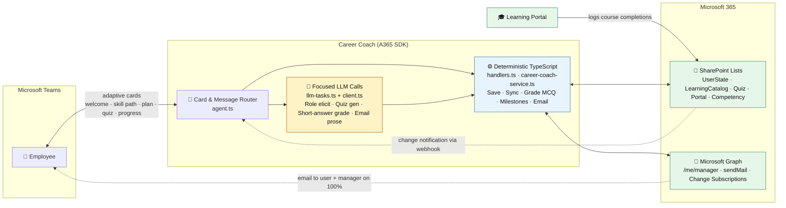
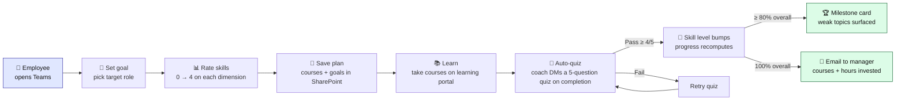
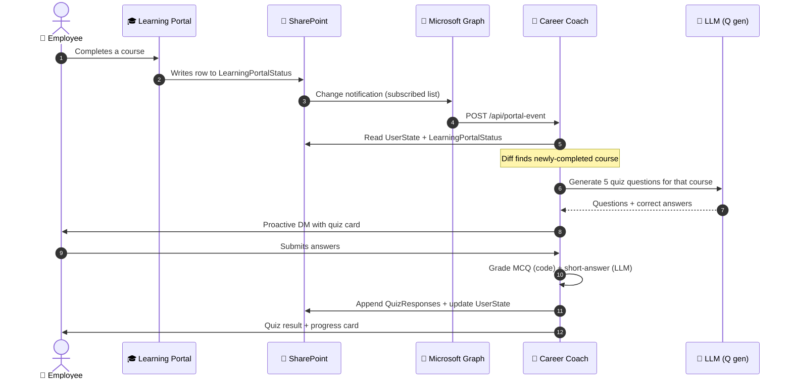
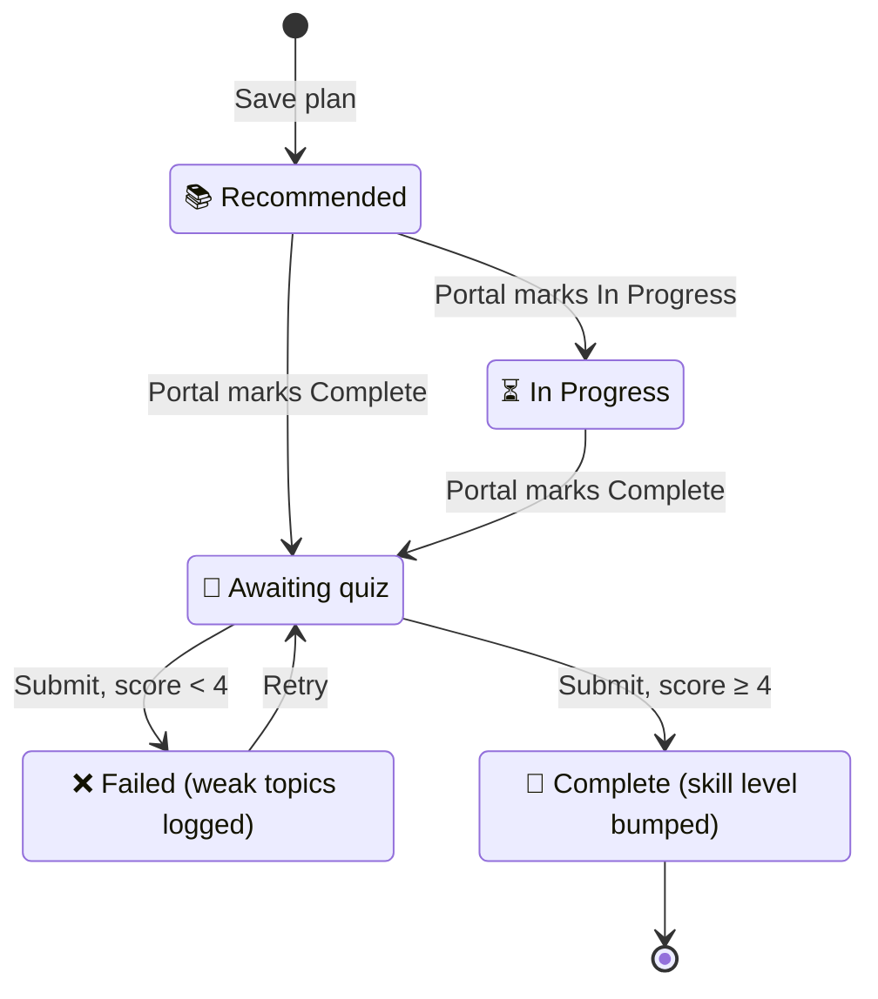

<!-- Copyright (c) Microsoft Corporation. Licensed under the MIT License. -->

# Career Coach — Design

A private AI **Career Coach** built on the Microsoft Agent 365 SDK + OpenAI Agents SDK. It helps an employee set a target role, maps their skill gaps against a competency framework, recommends courses, proactively quizzes them as they complete learning, fires milestone nudges, and drafts a manager wrap-up email — all as Adaptive Card conversations inside Microsoft Teams.

## 1. Design principles

1. **Deterministic-first.** The LLM is gated to only the paths that genuinely need language understanding: free-text role elicitation, quiz-question generation, short-answer grading, and completion-email prose. Every card submit, data write, MCQ grade, milestone rule, and email dispatch is plain TypeScript. This eliminates hallucinated skill bumps, wrong goal completion, and long invoke timeouts.
2. **Card actions never double-fire.** Every `Action.Execute` handler acknowledges fast; heavy work runs after the ack.
3. **Durable state in SharePoint.** Five lists hold all state; a disk-backed store keeps proactive conversation references across restarts.
4. **One path to Graph.** Runtime uses agentic auth (a delegated Graph token minted per turn — `/me` is whoever is in the chat). Setup/seed scripts use MSAL device-code + delegated scopes. No application-permission client secret at runtime.
5. **Grounded, not hallucinated.** All plan/progress state is read back from SharePoint before each write; the LLM never invents list IDs or progress values.
6. **Graceful degradation.** A365 lifecycle events are consumed by a top-priority route so onboarding never crashes the turn.

## 2. Architecture



**Hybrid pro-code:** the LLM handles free-text conversation and creative generation only; the deterministic TypeScript path owns every card submit, data write, business rule, and email.

## 3. User journey



## 4. Source layout

```
src/
├── index.ts                  Express server: /api/messages, /api/portal-event, /api/health
├── agent.ts                  MyAgent (AgentApplication) — message/notification/install routing +
│                             Action.Execute handlers (welcome, skill_ratings, save_plan, quiz_submit)
├── client.ts                 OpenAI Agents client + system prompt + observability wiring (LLM path)
├── cards.ts                  All Adaptive Card renderers + renderCard()/extractCards()
├── handlers.ts               Deterministic card handlers: skill ratings, save plan, quiz submit, sync
├── career-coach-service.ts   Pure business logic + typed SharePoint CRUD (gap analysis, grading,
│                             milestones, progress recompute)
├── career-coach-types.ts     Shared interfaces + SP_CONFIG
├── llm-tasks.ts              3 focused LLM sub-calls: quiz generation, short-answer grade, email prose
├── graph-service.ts          MSAL device-code + agentic Graph clients, sendMail, subscriptions
├── sharepoint-tools.ts       OpenAI function tools for the LLM path (agentic Graph, auto-correction)
├── sharepoint-column-map.ts  Display-name ↔ internal-name column translation
├── quiz-cache.ts             In-memory quiz answer-key store
├── file-storage.ts           Disk-backed Storage impl for the Proactive subsystem
├── proactive-refs.ts         AAD Object ID → conversation reference cache
├── subscription-manager.ts   Auto-create + auto-renew the Graph change subscription
├── openai-config.ts          Azure OpenAI vs OpenAI client selection
├── token-cache.ts            Observability token cache helpers
└── scripts/                  Setup, seed, and demo helpers (see README §9)
```

## 5. The five flows

Each flow is a deterministic handler in `handlers.ts`, backed by pure logic in `career-coach-service.ts`, with focused LLM sub-calls in `llm-tasks.ts`.

| Flow | Trigger | Key code |
|---|---|---|
| **Set goals + skill path** | `careercoach_welcome` tile → role name | `buildSkillPathForRole`, `findRole` |
| **Map skills + save plan** | `careercoach_skill_ratings` → `careercoach_save_plan` | `handleSkillRatingsSubmit`, `handleSavePlanSubmit`, `matchCoursesForSkill`, `gapCategoryFor` |
| **Proactive quiz** | Graph change notification → `/api/portal-event` | `handleSyncProgress`, `generateQuizQuestions`, `handleQuizSubmit`, `gradeMcqAnswer`, `gradeShortAnswers` |
| **80% milestone** | recompute after a quiz pass | `recomputeGoalsAndOverall`, `computeMilestoneAggregate` |
| **100% completion + email** | all goals reach 100% | `composeCompletionEmail`, `sendMail` (Graph `/me/sendMail`) |

### Feature 1 — portal → proactive quiz (sequence)



### Course state lifecycle



## 6. SharePoint schema

| List | Access | Purpose |
|---|---|---|
| `CompetencyFramework_v2` | read | Role → required-skill mapping (per level) |
| `LearningCatalog_v2` | read | Courses mapped to skills, with from/to levels |
| `UserState` | read/write | One row per user — the living plan (JSON columns: Goals, Skills, LearningProgress) |
| `LearningPortalStatus` | read | Mimicked learning-portal telemetry (the Feature 1 trigger source) |
| `QuizResponses` | write | Append-only audit log of every quiz attempt |

Column display-name ↔ internal-name translation is handled by `sharepoint-column-map.ts`. Lists are created idempotently by `npm run setup:sharepoint` and seeded by `npm run seed:reference`.

## 7. Auth model

- **Runtime (agentic auth):** the A365 platform mints a delegated Graph token per turn (`getAgenticGraphClient` in `graph-service.ts`). `/me`, `/me/manager`, and `/me/sendMail` resolve to the user in the current chat. No client secret is used at runtime.
- **Scripts (MSAL device-code):** `setup:sharepoint` / `seed:reference` / `mark:complete` etc. sign in once interactively as a developer with `Sites.ReadWrite.All`; the token is cached in `.mstoken-cache.json`.

## 8. Observability

`client.ts` configures the A365 `ObservabilityManager` with a token resolver (built-in `AgenticTokenCacheInstance`, or a custom resolver when `Use_Custom_Resolver=true`) and enables the OpenAI Agents auto-instrumentor. The message handler in `agent.ts` builds a baggage scope from the turn context and preloads the observability token before invoking the LLM path, so `invoke_agent` / `chat` spans carry the runtime agent identity. Set `ENABLE_A365_OBSERVABILITY_EXPORTER=true` to export to MAC Activity; the default is console-only.

## 9. Extension points

1. **New card flow** — add a renderer in `cards.ts` + an `adaptiveCards.actionExecute(<verb>, …)` route in `agent.ts` + a handler in `handlers.ts`.
2. **New business rule** — add pure logic to `career-coach-service.ts` (fully unit-testable, no I/O).
3. **New LLM sub-call** — add a focused function to `llm-tasks.ts`; keep it narrow and structured.
4. **Different data backend** — swap the SharePoint CRUD in `career-coach-service.ts` / `graph-service.ts`.
5. **Production mail** — replace delegated `/me/sendMail` with app-only `Mail.Send` + `Sites.Selected`.
