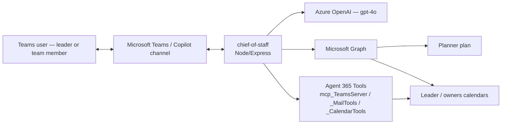
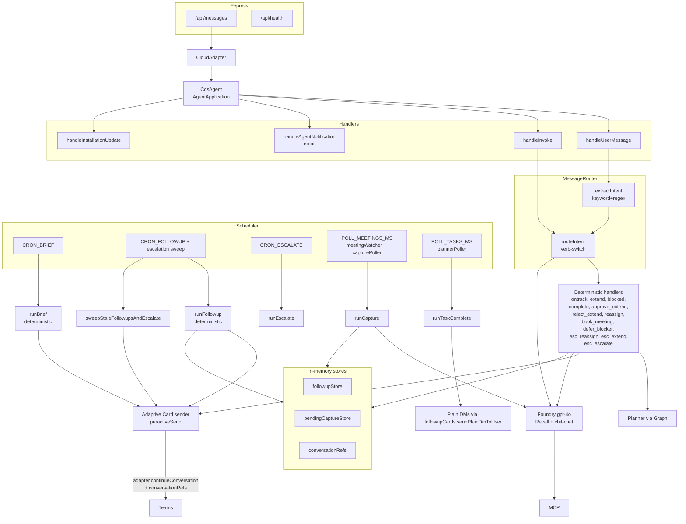
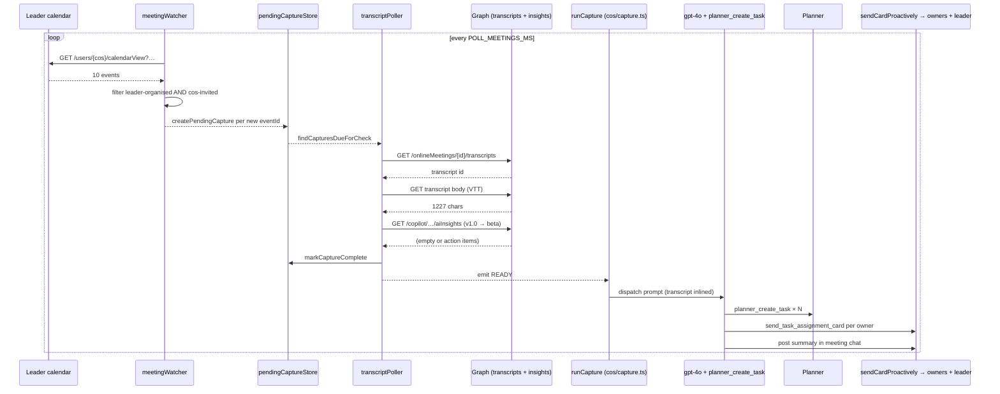
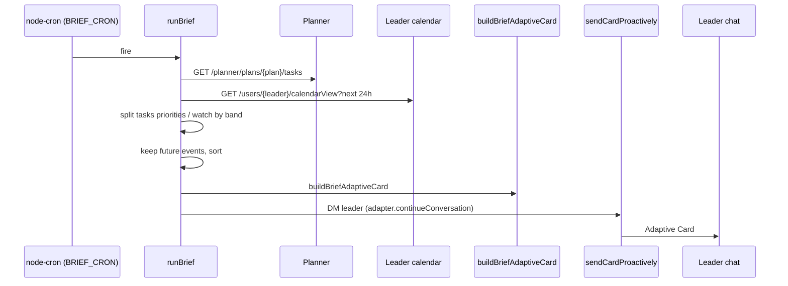
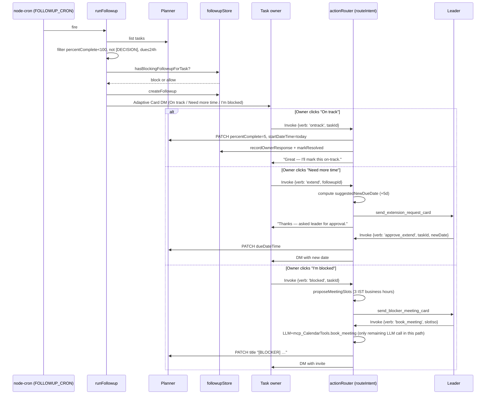
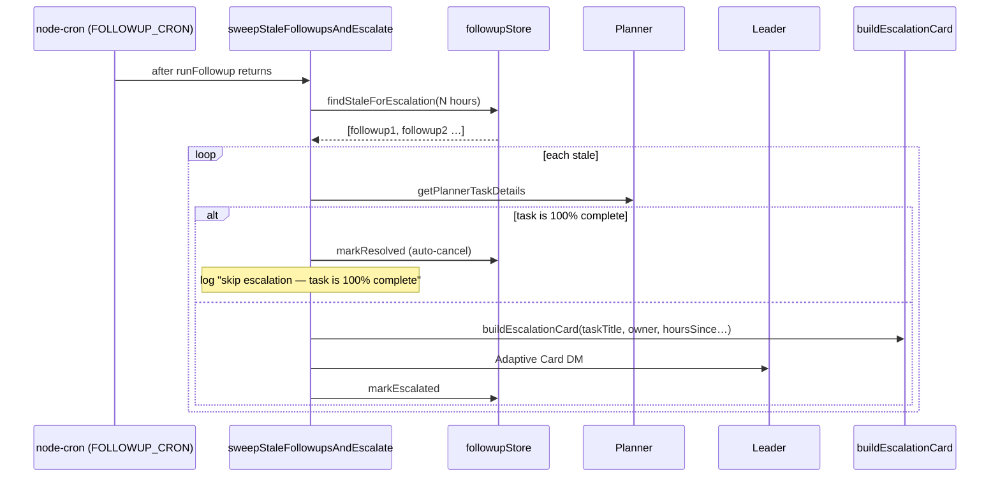
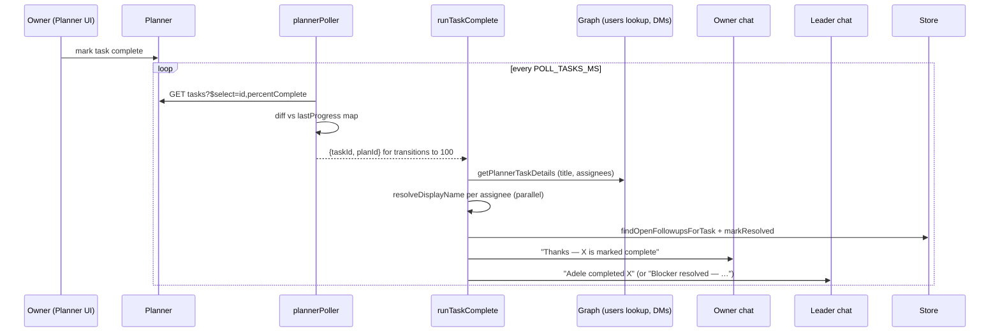
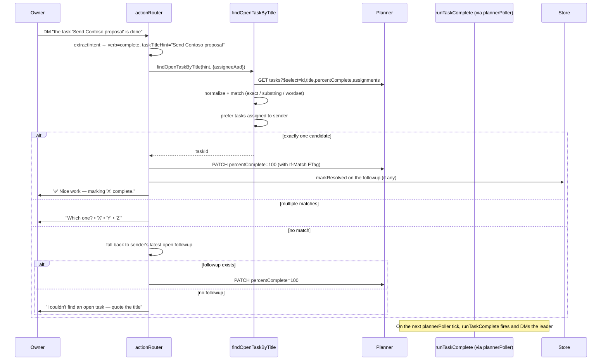
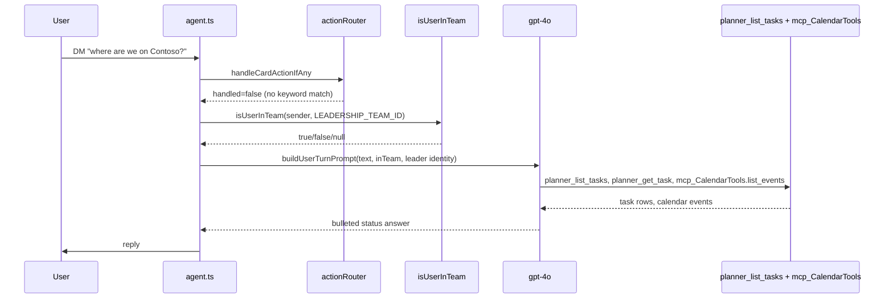

# Chief of Staff — Design Document

Architecture, per-flow sequences, module responsibilities, and extension
points for the `chief-of-staff` scenario. Intended audience: developers reading the code
for the first time, and anyone extending it.

> 🔧 For setup and operational instructions, see **[README.md](README.md)**.

---

## Contents

1. [Design principles](#1-design-principles)
2. [System context (deployment view)](#2-system-context-deployment-view)
3. [High-level component diagram](#3-high-level-component-diagram)
4. [Runtime model (how the process behaves)](#4-runtime-model-how-the-process-behaves)
5. [The seven flows (sequence diagrams)](#5-the-seven-flows-sequence-diagrams)
6. [Data model + in-memory stores](#6-data-model--in-memory-stores)
7. [Auth architecture — dual identity](#7-auth-architecture--dual-identity)
8. [Determinism boundary — where the LLM lives](#8-determinism-boundary--where-the-llm-lives)
9. [Card lifecycle](#9-card-lifecycle)
10. [Concurrency, idempotency, and dedup](#10-concurrency-idempotency-and-dedup)
11. [Observability](#11-observability)
12. [Extension points](#12-extension-points)
13. [Known limitations + hardening TODOs](#13-known-limitations--hardening-todos)
14. [Complete file map](#14-complete-file-map)

---

## 1. Design principles

The agent was built around six explicit principles. Every design decision
below reflects one or more of them.

1. **Deterministic-first.** Every action a leader depends on (filter Planner,
   propose slot times, PATCH due dates, decide who to escalate to) is
   TypeScript, not the LLM. The LLM is used only where language
   understanding is genuinely required (chat, meeting-transcript parsing)
   or as an MCP transport we can't bypass (calendar booking).
2. **Card actions must never double-fire.** Teams / Copilot channel enforces a
   ~5-second SLA on both Invoke and card-shaped Message activities. Every
   card-action path ACKs within a few hundred ms and runs the heavy work via
   `adapter.continueConversation`, protected by two-layer dedup guards.
3. **Graceful degradation, never a crash.** Every scheduled path is wrapped in
   `try/catch`, plus process-level `unhandledRejection` / `uncaughtException`
   handlers keep the server alive. Failed Graph calls emit a warning and
   the loop keeps ticking.
4. **One path to Graph.** Every Graph call uses the standalone
   cos-graph-worker application-permission token. No delegated /
   agentic-OBO Graph path exists — blueprint and agent-instance
   identities get no extra Graph scopes. See §7.
5. **State is intentionally in-memory for the MVP.** All three stores
   (`followupStore`, `pendingCaptureStore`, `conversationRefs`) are
   `Map` instances. Fine for a demo; swap for persistent storage before
   production (see §13).
6. **The scheduler owns time. The agent owns turns.** Cron and pollers live
   in `scheduler.ts`. User-driven turns (message + Invoke) live in
   `agent.ts`. The two never share code paths — they only share the same
   in-memory stores.

---

## 2. System context (deployment view)



- Users interact with the agent **only** through Teams (DM chat + Adaptive
  Cards). Nothing is exposed to the internet except `/api/messages` (behind
  the Bot Framework JWT middleware) and `/api/health`.
- The agent talks to **Microsoft Graph** directly for Planner CRUD, calendar
  view, transcripts, AI insights, chat DMs.
- The agent talks to **Foundry** (Azure OpenAI, `gpt-4o`) via
  `@openai/agents` for capture extraction and chat/Recall.
- **MCP tool servers** hosted by Agent 365 provide message/mail/calendar
  actions the LLM can call by name (`mcp_TeamsServer.get_meeting_transcript`,
  `mcp_CalendarTools.book_meeting`, etc.).

---

## 3. High-level component diagram



The scheduler and the message handlers share **state** (the three stores) but
not code. They only touch each other through those stores.

---

## 4. Runtime model (how the process behaves)

### 4.1 Boot sequence

1. `src/index.ts` loads `.env` (with `override:true` so `.env` wins over the
   shell), installs `httpLogger` and prints the startup banner
   (`src/startup-check.ts`).
2. It imports `src/agent.ts`, which:
   - Constructs `CosAgent` (an `AgentApplication` with `MemoryStorage` and
     `authorization: { agentic: { type: 'agentic' } }`).
   - Registers activity handlers (message, Invoke, agentNotification,
     installationUpdate).
   - Calls `startScheduler(...)` — cron jobs and polling intervals are
     created but they will **no-op until a user DMs the agent**, because
     they need a cached `ConversationReference` to reconstitute a valid
     `TurnContext` for agentic auth.
3. Express starts listening on `PORT` (default 3978). Two endpoints are
   exposed: `POST /api/messages` (Bot Framework, JWT-guarded) and
   `GET /api/health` (unauthenticated).

### 4.2 First user turn

1. Teams POSTs an Activity to `/api/messages`.
2. `authorizeJWT` validates the token.
3. `CloudAdapter.process` unpacks the activity, calls
   `agentApplication.run(context)`.
4. The message handler (`handleUserMessage`) does two housekeeping steps
   before anything else:
   - `cacheConversationReference(activity)` in `scheduler.ts` — this
     unblocks all crons and pollers.
   - `rememberConversationRef(activity)` in `state/conversationRefs.ts` —
     stores the sender's ref keyed by their AAD Object ID so future
     Adaptive Card DMs can reach them.
5. The handler runs the router / LLM as normal.

### 4.3 Every subsequent turn

The message handler:

1. Caches / refreshes the conversation reference (idempotent).
2. Sniffs whether the activity is a card submit (`activity.value.verb` is set).
3. **If card submit** → fast-ack path (see §10.1) and hand off to
   `handleCardActionIfAny` via `adapter.continueConversation`. Return
   within a few hundred ms.
4. **Else** → send `Got it — working on it…`, resolve the leader AAD,
   check team membership, run `handleCardActionIfAny` (in case of a
   keyword-only reply like `blocked`), and if not handled, run one LLM
   turn with `buildUserTurnPrompt(...)`.

### 4.4 Every scheduled tick

`scheduler.ts` uses `fireInAuthedContext(deps, name, cb)` to reconstitute a
`TurnContext` from the cached `ConversationReference`, exchange the agentic
token for the right scope, build a `Client` (with MCP tool servers attached),
then run `cb(ctx, state, client)`. All scheduled handlers use this envelope
— they never touch tokens directly.

### 4.5 Every capture tick

Distinct from the scheduler's cron cadence, meeting capture runs its own
two-pass sweep inside `pollForNewTranscripts` (invoked by the meeting-poll
setInterval, guarded by `meetingPollInFlight` — see §10.2):

- **Pass 1 — discovery.** `discoverQualifyingMeetings` reads the calendar of
  the graph-owner (CoS agent by default), filters to
  `leader-organised AND CoS-invited`, resolves each event's `joinWebUrl` to
  an `onlineMeetingId`, and adds any new ones to `pendingCaptureStore`.
- **Pass 2 — retry sweep.** For each pending capture whose `nextCheckAt` has
  arrived, `advanceCapture` tries to fetch the transcript and Copilot
  insights, then decides one of three outcomes:
  1. **Ready** — transcript is here AND (insights arrived OR wait budget
     exhausted OR `attempts >= CAPTURE_MIN_ATTEMPTS_TRANSCRIPT_ONLY`).
     Emits the capture to the scheduler, which fires `runCapture`.
  2. **Give up** — no transcript after `CAPTURE_GIVE_UP_AFTER_HOURS`.
     Marks the capture `gave-up` and moves on.
  3. **Retry** — computes the next delay from a `[1, 3, 7, 15, 30]` minute
     ladder (clamped by wait budget) and updates `nextCheckAt`.

---

## 5. The seven flows (sequence diagrams)

### 5.1 Capture



Two things to note:

- The capture prompt is very prescriptive. It anchors "today's" date, lists
  the leader AAD as the fallback assignee, insists on a due date, and treats
  meeting/transcript content as **untrusted** (prompt-injection defense).
- When `hasInsights=false` (no Copilot license or empty response) the LLM
  extracts from the raw VTT — with the same output contract. That's the path
  demo tenants without a Copilot license end up on, and it produces the same
  Planner tasks. Just uses more tokens.

### 5.2 Daily Brief



The Brief is **entirely deterministic** — no LLM call. The rewrite fixed the
"empty brief" and "hallucinated time" bugs the old LLM-driven version had.

### 5.3 Follow-up + card responses



The router's `extractIntent` (in `cards/actionRouter.ts`) also handles
**keyword text replies** — `ontrack`, `extend`, `blocked`, `approve`,
`reject`, `reassign`, `defer`, and the new completion detection (see §5.6)
all work even in Teams builds where Graph-sent Adaptive Card clicks don't
route back as Invoke activities.

### 5.4 Escalation



Two-layer guard against sending an escalation for an already-closed task:

1. `runTaskComplete` calls `findOpenFollowupsForTask` and `markResolved` on
   each open followup before the leader-notify DM.
2. The escalation sweep re-checks Planner state via `getPlannerTaskDetails`
   just before sending the card. Belt-and-suspenders for the race window
   between chat-completion and the next Planner poll tick, plus process
   restarts that wipe `followupStore`.

### 5.5 Task complete via Planner UI



`plannerPoller` seeds a baseline on its first tick so already-complete tasks
don't spuriously fire `runTaskComplete` at startup. Only *transitions*
(prev<100 && curr==100) count.

### 5.6 Task complete via chat



The completion detection lives in `extractIntent`. It matches phrases
(`\b(complet(ed|e|ing)|finish(ed)?|done|closed?|wrapped( up)?)\b`) and pulls
a quoted title (straight/curly quotes, backticks) as the primary hint. Short
messages without a quoted title fall back to the sender's latest open
follow-up. Long narrative messages are ignored so the router doesn't hijack
a sentence like *"I got the design done but need help wrapping up the
prototype."*

### 5.7 Recall / chit-chat (the only LLM-first flow)



The system prompt (`AGENT_INSTRUCTIONS` in `src/client.ts`) hard-codes the
Recall gate: **non-team members get a polite refusal**, and the LLM must not
reveal task titles or meeting names to them. This is defence in depth on
top of any Graph-level access controls.

---

## 6. Data model + in-memory stores

All three stores are `PersistentMap<V>` instances (subclass of `Map` that
transparently JSON-serialises to a file on disk). Public API is identical to
a plain `Map`; every mutation schedules a 200 ms debounced write. Hydration
is synchronous at construction time. See
[`src/state/persistentMap.ts`](src/state/persistentMap.ts) and
[§10.6](#106-state-persistence).

### 6.1 `PendingFollowup` — `src/state/followupStore.ts`

```ts
{
  followupId: string;         // uuid
  taskId: string;             // Planner task id
  taskTitle: string;
  ownerAad: string;
  ownerName: string;
  dueDate?: string;           // ISO
  sentAt: number;
  status: 'pending' | 'responded' | 'escalated' | 'resolved';
  responseKind?: 'ontrack' | 'extend' | 'blocked';
  respondedAt?: number;
  escalatedAt?: number;
  meetingScheduledAt?: number;
  extendedTo?: string;
}
```

Exported queries:

- `createFollowup`, `getFollowup`
- `findLatestOpenFollowupForOwner` — used when a keyword reply arrives and
  we don't know which followup it's for.
- `recordOwnerResponse`, `markEscalated`, `markResolved`
- `findStaleForEscalation(hoursSinceSent)` — the escalation sweep
- `findOpenFollowupsForTask(taskId)` — used by `runTaskComplete` +
  `completePlannerTask` handler to auto-cancel escalation on close
- `listAll` — diagnostics + cooldown checks

### 6.2 `PendingCapture` — `src/state/pendingCaptureStore.ts`

```ts
{
  eventId: string;            // calendar event id — primary dedupe key
  meetingId: string;
  subject: string;
  organizerAad?: string;
  ownerUpn: string;           // whose Graph path we hit
  chatId?: string;
  endTime: number;
  durationMinutes: number;
  waitBudgetMinutes: number;
  createdAt: number;
  giveUpAfter: number;
  status: 'pending' | 'ready' | 'complete' | 'gave-up';
  attempts: number;
  nextCheckAt: number;
  transcriptId?: string;
  transcriptFetchedAt?: number;
  transcriptContent?: string; // raw WebVTT body
  insightsFetched: boolean;
  insightsActionItems?: SimpleActionItem[];
  insightsMeetingNotes?: SimpleMeetingNote[];
}
```

Wait-budget math:

```
waitBudgetMinutes = clamp(
  durationMinutes × INSIGHTS_WAIT_MULTIPLIER,
  INSIGHTS_MIN_WAIT_MINUTES,
  INSIGHTS_MAX_WAIT_MINUTES
)
```

Retry ladder (in `pickNextRetryDelayMinutes`): `[1, 3, 7, 15, 30]` minutes,
capped by `waitBudgetMinutes`.

### 6.3 `ConversationReference` store — `src/state/conversationRefs.ts`

`PersistentMap<aadObjectId, Partial<ConversationReference>>`. Populated on
every inbound Activity from users we haven't seen. Consumed by
`sendCardProactively` — Adaptive Card DMs use
`adapter.continueConversation(botAppId, ref, cb)` to reach a specific user.

**Consequence:** a recipient must have DM'd the agent at least once for the
agent to send them a proactive card. The leader always has (they use the
agent), so the Brief always works. For follow-up owners we rely on Capture's
`send_task_assignment_card` to establish the ref — that DM works because it
goes to the owner (whom we captured the ref for the moment they said "hi"
to the agent), or falls back to plain-text if not.

Because the store is now persistent, users only need to DM the agent **once,
ever** — not once per process restart.

For the demo tenant, both users (leader + team member) DM'd the agent
during setup, so cards land reliably.

---

## 7. Auth architecture — dual identity

Two identities that must both exist and be consented:

### 7.1 Agentic identity (Bot Framework side)

Created by `a365 develop setup`. The blueprint app has:

- Its own Entra app registration + service principal.
- An **agentic user** with a mailbox, Teams identity, and calendar.
- A per-tenant *instance app* the platform provisions transparently.

Used for:

- Verifying JWTs on `/api/messages` (the Bot Framework token).
- Every `adapter.continueConversation(...)` call (proactive DMs).
- Every `context.sendActivity(...)` reply.
- The MCP tool servers (`ea9ffc3e-8a23-4a7d-836d-234d7c7565c1` audience).
- The Foundry client (`configureOpenAIClient` in `src/openai-config.ts`).

### 7.2 Graph identity (Graph API side)

**Every** outbound Microsoft Graph call is made with the standalone
*cos-graph-worker* app's client credentials (MSAL
`ConfidentialClientApplication`, `client_credentials` grant against
`https://graph.microsoft.com/.default`). See
[`src/graph/graphAppToken.ts`](src/graph/graphAppToken.ts).

- Configured by three env vars: `GRAPH_APP_ID`, `GRAPH_APP_SECRET`,
  `GRAPH_TENANT_ID` (see README §3b).
- Application permissions granted on the worker app:
  `Calendars.Read`, `OnlineMeetings.Read.All`,
  `OnlineMeetingTranscript.Read.All`, `OnlineMeetingAiInsight.Read.All`,
  `Chat.Create`, `Chat.ReadWrite.All`,
  `Tasks.ReadWrite.All`, `User.Read.All`, `Group.Read.All`.
- Meeting transcript / insight calls additionally require a Teams
  *application-access policy* granted to the CoS agent UPN (or
  tenant-wide).

**Nothing on the blueprint or agent-instance identity is used for Graph
access.** This is by design: every extra scope on those identities widens
the attack surface and requires re-consent through the fragile agentic
OBO chain in demo tenants. The blueprint keeps only what
`a365 develop setup` provisions (MCP + platform APIs — see Appendix A).

**Two internal helpers, both worker-backed:**
- [`src/graph/graphAppToken.ts::acquireAppOnlyGraphToken`](src/graph/graphAppToken.ts)
  — the raw worker-token accessor. Used directly by all pollers,
  `plannerConfig`, `capture`, `followup`, `brief`, `taskComplete`, and the
  deterministic Planner helpers in `plannerTools.ts`.
- [`src/graph/peopleTools.ts::acquireGraphToken`](src/graph/peopleTools.ts)
  and [`src/graph/plannerTools.ts::acquireGraphToken`](src/graph/plannerTools.ts)
  — thin shims that accept an `opts` bag (retained for API compatibility)
  and delegate to `acquireAppOnlyGraphToken()`. If the three
  `GRAPH_APP_*` env vars are unset the shim throws immediately at first
  Graph call — the process refuses to fall back to delegated auth.

**Adaptive Card DMs never use Graph.** They go through Bot Framework
proactive messaging (`adapter.continueConversation`) using a cached
`ConversationReference` for the recipient. If no reference is cached the
card is skipped with a warning — the recipient must DM the agent (or
install the app) at least once first. The reference store is persisted
across restarts (`.cos-state/conversation-refs.json`).


---

## 8. Determinism boundary — where the LLM lives

Two places, and only two:

1. **`src/cos/capture.ts` → `runCapture`.** One LLM turn per meeting.
   Extracts action items + decisions from a transcript (rich Copilot
   insights when available; raw VTT otherwise). Calls
   `planner_create_task` + `send_task_assignment_card` + `mcp_TeamsServer`
   to post the meeting summary.
2. **`src/agent.ts` → `handleUserMessage` fallback path.** One LLM turn per
   user DM that isn't a card action or keyword reply. Powers Recall and
   chit-chat. The Unblock flow described in the system prompt is only
   used when the user DMs the agent about a blocker in free text —
   the deterministic `blocked` verb (card click or keyword) is the primary
   path.

The blocker card handler's calendar booking (`book_meeting` verb) also
routes through the LLM, but only because `mcp_CalendarTools.book_meeting`
is exposed as an MCP tool and not (yet) directly reachable via HTTP. The
LLM is fed fully pre-computed values with a 1-token response contract
(`OK` / `FAIL: reason`) so it can't hallucinate.

Everything else — filtering Planner tasks in Brief and Follow-up, computing
new due dates in Extend, proposing meeting slots in Blocker, resolving
`taskTitleHint` to a Planner task in the chat-completion flow, deciding
whether to escalate — is straight TypeScript.

---

## 9. Card lifecycle

### 9.1 Sending

All Adaptive Cards go through `src/cards/proactiveSend.ts::sendCardProactively`:

```
adapter.continueConversation(botAppId, ref, ctx => {
  ctx.sendActivity({
    type: 'message',
    attachments: [{
      contentType: 'application/vnd.microsoft.card.adaptive',
      content: card
    }],
  });
});
```

Requirements: `botAppId` (from `agent_id` env), a cached
`ConversationReference` for the recipient (see §6.3), and a valid card
object. The card builders live in `src/cards/briefTool.ts` and
`src/cards/followupCards.ts`.

We deliberately **do not** use Graph's `POST /chats/{id}/messages` for
sending cards — it requires `Teamwork.Migrate.All` under application-permission
tokens, which is an import-only role. Bot Framework proactive messaging is
the only reliable path.

### 9.2 Receiving clicks

Two shapes, both handled:

- **Invoke activity** (`activity.type === 'invoke'`, `activity.name` set).
  Standard Bot Framework flow. Handled by `handleInvoke` in agent.ts.
- **Message activity** with `activity.value.verb` set. Some Teams builds
  wrap card submits this way when the card was sent via the Graph pathway.
  Handled by `handleUserMessage`'s cardSubmit branch.

Both paths converge on `handleCardActionIfAny(context, client, leaderAad)`
in `src/cards/actionRouter.ts`. That's the single entry point for every
card-driven verb.

### 9.3 The verbs

All card verbs are strings in `activity.value.verb`:

| Verb | Sent from | Handler |
|---|---|---|
| `ontrack` | Follow-up check-in | Deterministic: `acknowledgePlannerTask` (5%) + `markResolved` |
| `extend` | Follow-up check-in | Compute new date, send extension request card to leader |
| `blocked` | Follow-up check-in | Propose 3 slots, send blocker meeting card to leader |
| `complete` | (also matched via chat regex) | `findOpenTaskByTitle` → `completePlannerTask` (100%) |
| `approve_extend` | Extension request card | `updatePlannerTaskDueDate` + DM owner |
| `reject_extend` | Extension request card | DM owner "not approved" |
| `reassign` | Escalation card | DM owner (leader will follow up manually) |
| `book_meeting` | Blocker meeting card | LLM + `mcp_CalendarTools.book_meeting`, PATCH `[BLOCKER]` title prefix |
| `defer_blocker` | Blocker meeting card | Snooze — resolves the followup with a note |
| `esc_reassign` / `esc_extend` / `esc_escalate` | Escalation card | DM owner appropriate acknowledgement |

Each handler is a small `if (intent.verb === '…') { … return {handled:true}; }`
block in `actionRouter.ts`. New verbs are added by defining the card action
in the card builder + adding a branch in the router.

---

## 10. Concurrency, idempotency, and dedup

### 10.1 Fast-ack (Teams 5-second SLA)

Teams / Copilot channel enforces a ~5 s SLA on:

- Every Invoke activity (Bot Framework standard).
- **Every** card-submit that arrives as a Message activity (empirically
  observed in the Copilot channel).

If the response is late, Teams shows a red *"Something went wrong. Please
try again."* toast **and typically retries** — which used to double-fire
booking, DMs, etc.

Fix, in both `handleInvoke` and the card-submit branch of `handleUserMessage`:

1. Snapshot `conversationRef`, `adapter`, `botAppId`, `authorization`,
   `originalActivity`.
2. Send an empty `invokeResponse` immediately (Invoke path only).
3. `void (async () => { adapter.continueConversation(botAppId, ref, async proactiveCtx => { … }) })()` —
   fire-and-forget continuation.
4. Return from the handler within a few hundred ms.

Inside the continuation, `Object.assign(proactiveCtx.activity as any, {...original fields...})`
is used because `TurnContext.activity` is a **getter-only** property — trying
to reassign it throws
`TypeError: Cannot set property activity of #<TurnContext> which has only a getter`.

### 10.2 Overlapping meeting-polls

If `POLL_MEETINGS_MS` is short (e.g. 15 s) but a full sweep takes 20-30 s
(a per-meeting Graph roundtrip × 10 meetings), two ticks can run
concurrently, both see the same "ready" capture, both fire `runCapture`,
both create Planner tasks.

Fix, in `scheduler.ts`:

```ts
let meetingPollInFlight = false;
setInterval(async () => {
  if (meetingPollInFlight) {
    console.log('[scheduler] meeting-poll skipped — previous scan still in flight');
    return;
  }
  meetingPollInFlight = true;
  try { await fireInAuthedContext(...); }
  finally { meetingPollInFlight = false; }
}, POLL_MEETINGS_MS);
```

`try/finally` guarantees the guard clears even on crashes.

### 10.3 Dedup guards in the router

`src/cards/actionRouter.ts` has two module-scoped `Map` guards, both with
60 s TTL:

- `cardInvokeSeen` keyed by `${activity.id}:${verb}` — catches Teams'
  invoke retries for every verb.
- `bookMeetingSeen` keyed by the slot ISO — belt-and-suspenders in case
  a retry ever comes through with a fresh `activity.id`.

Both maps GC entries older than 60 s on every check.

### 10.4 Planner writes

Every Planner write (title update, due-date PATCH, `percentComplete: 100`
PATCH) does a **GET first** to grab the ETag, uses `If-Match`, and skips the
PATCH when the desired state is already present. This makes every write
idempotent — you can safely re-run any handler.

### 10.5 Follow-up cooldowns

`hasBlockingFollowupForTask` (`src/cos/followup.ts`) checks the store
before creating a new followup and blocks if:

- The owner already has a **pending/escalated** followup on that task
  (per-owner, so reassignment auto-cleans the previous owner's record).
- A meeting was scheduled for that task within the last **24 h**
  (`MEETING_SCHEDULED_COOLDOWN_HOURS`).
- The owner responded within the last `FOLLOWUP_COOLDOWN_HOURS` (default 4).
- A resolved followup exists whose `sentAt` is within the cooldown window.

All rejection reasons are logged so you can see exactly *why* a task didn't
get a check-in.

### 10.6 State persistence

Every store that carries dedup-relevant state is backed by a
`PersistentMap` (`src/state/persistentMap.ts`) — a `Map` subclass that
synchronously hydrates from a JSON file on construction and schedules a
debounced (200 ms) write on every mutation. This makes restarts safe:

| Store | File | TTL prune on hydrate | Fat-field strip on persist |
|---|---|---|---|
| `pendingCaptureStore` | `pending-captures.json` | Terminal records older than `CAPTURE_STATE_RETENTION_DAYS` (30) | `transcriptContent`, insights arrays dropped for `complete`/`gave-up` records |
| `followupStore` | `followups.json` | Terminal records older than `FOLLOWUP_STATE_RETENTION_HOURS` (72) | None |
| `conversationRefs` | `conversation-refs.json` | None — refs are tiny and useful indefinitely | None |
| `plannerPoller.lastProgress` | `planner-progress.json` | None — `{taskId: percent}` map | None |

**Guarantees:**

- **No re-capture on restart.** `pendingCaptureStore.hasCaptureForEvent(eventId)`
  returns `true` for meetings captured in previous runs, so `runDiscoveryPass`
  skips them.
- **No missed completions during downtime.** `plannerPoller` compares each
  poll against the last-known state from disk, so a `<100 → 100` transition
  that happened while the process was down still fires on the next poll.
- **No lost escalations across restart.** In-flight `pending`/`escalated`
  follow-ups are always kept (bypass TTL prune).
- **No 're-DM the agent' friction.** Persisted `ConversationReference`s
  let proactive cards fire immediately on boot.

**On-disk footprint:**

- `transcriptContent` (up to 60 KB per meeting) is stripped on
  `markCaptureComplete` / `markCaptureGaveUp` via the `serializeTransform`
  hook. Terminal records shrink to ~200 bytes.
- At 100 meetings/day × 30 days retention ≈ **600 KB** total.
- Corrupt files are renamed `.corrupt` and hydration falls back to empty
  — worst case, one round of re-captures on next tick (same behaviour as
  before persistence).

**Atomicity:** every write goes through `writeFileSync(tmp)` → `renameSync(tmp, file)`,
so the target file is either the old contents or the new — never torn.

**Shutdown flush:** `PersistentMap` wires `process.on('exit' | 'SIGINT' | 'SIGTERM')`
handlers that call `flushSync` on every live instance, so nodemon restarts
and App Service shutdowns don't lose queued mutations. On a hard `kill -9`
or power loss, up to 200 ms of mutations may be lost — acceptable trade
for the cheap debounced writes.

**Env knobs:**

```
STATE_BACKEND=file          # default — or 'null' to disable persistence
STATE_DIR=./.cos-state      # local; /home/data/cos-state on App Service
CAPTURE_STATE_RETENTION_DAYS=30
FOLLOWUP_STATE_RETENTION_HOURS=72
```

---

## 11. Observability

### 11.1 Logging

- `src/util/logger.ts` — level-based (`error` / `warn` / `info` / `debug` /
  `trace`), controlled by `LOG_LEVEL`. Every module logs with a namespace
  prefix (`capture`, `capturePoller`, `plannerPoller`, `scheduler`,
  `graphAppToken`, `httpLogger`, …) so you can grep.
- `src/util/httpLogger.ts` — global axios interceptor gated on `LOG_HTTP`.
  Logs every outbound HTTP request + response with masked auth headers and
  latency in ms. Essential for debugging Graph 4xx/5xx.

### 11.2 Agent 365 Observability

Configured in `src/client.ts` via `@microsoft/agents-a365-observability` +
`@microsoft/agents-a365-observability-extensions-openai`. Each LLM run is a
span (`Chat gpt-4o`) exported to
`https://agent365.svc.cloud.microsoft/observability/tenants/{tenantId}/agents/{agentId}/traces`.
`InferenceScope.start(...)` wraps every `invokeAgentWithScope` call.

### 11.3 Startup banner

`src/startup-check.ts::printStartupBanner()` prints ✅ / ⚠️ / ❌ / ℹ️ per
config item at boot. Missing required env vars are ❌; missing optionals are
⚠️ with a note about what will silently be disabled. Read the banner first
whenever something isn't working.

---

## 12. Extension points

### 12.1 Add a new card verb

1. Add the button to the card builder (in `src/cards/followupCards.ts` or a
   new builder). Give it a `verb` string.
2. Add a branch in `routeIntent` in `src/cards/actionRouter.ts`:
   ```ts
   if (intent.verb === 'my_new_verb') {
     // resolve target from intent.data + followup + planner
     // do the deterministic work
     await context.sendActivity('acknowledgement');
     return { handled: true };
   }
   ```
3. (Optional) Add a keyword to `kwMap` in `extractIntent` so users can
   trigger it by typing.

### 12.2 Add a new scheduled flow

1. Write your handler as `runX(payload, ctx, state, client)` in `src/cos/`.
2. Add a cron in `startScheduler` (`src/scheduler.ts`) using `CronJob.from({…})`.
3. Or add a `setInterval` if it's a polling loop.
4. Wrap the body in `fireInAuthedContext(deps, 'x', async (ctx, state, client) => { … })`
   so it gets a valid TurnContext.

### 12.3 Add a new LLM tool (function)

- **Graph-backed**: add a `tool({ name, description, parameters, execute })`
  export next to `plannerTools.ts` / `peopleTools.ts`, hand it to the
  `Agent` constructor in `src/client.ts` (spread it into `tools: [...]`).
  Use `additionalProperties: false` on every param schema — Azure OpenAI's
  strict validator requires it.
- **MCP-backed**: add an entry to `ToolingManifest.json`. It'll be picked up
  by `McpToolRegistrationService.addToolServersToAgent`.

### 12.4 Add a new Adaptive Card

Copy the pattern in `src/cards/followupCards.ts`:

1. Define a strict input interface (`args`).
2. `buildXCard(args): object` — pure function, returns the card JSON.
3. `sendXCardDirect(opts, args)` — proactive send helper.
4. (Optional) `createXTool(opts)` — LLM-facing `tool({...})` wrapper.

### 12.5 Change the leadership team gate

`src/agent.ts` calls `client.isUserInTeam(senderAad, LEADERSHIP_TEAM_ID)`.
`isUserInTeam` (in `src/graph/peopleTools.ts`) returns
`true`/`false`/`null`. `null` means "no team configured, allow all". The LLM
prompt (`buildUserTurnPrompt`) forwards the boolean into the system prompt
so the LLM can refuse politely. To swap the gate for a Graph group
membership check, an Entra dynamic group, or SharePoint list, just change
that function.

---

## 13. Known limitations + hardening TODOs

Everything in this section is intentional for the MVP — none of them
prevent the demo. Address before pilot / production.

- **File-backed persistence is single-instance only.** `PersistentMap`
  writes JSON files under `STATE_DIR`. Fine for local dev and
  single-instance Azure App Service (use `STATE_DIR=/home/data/cos-state`).
  If you scale out to multiple instances or move to AKS, swap in Blob
  Storage: implement a `BlobStateBackend` behind the same public API and
  wire it in `persistentMap.ts` (roughly a 90-minute lift).
- **Escalation is best-effort during long downtimes.** If the process is
  down when a followup would have escalated, the escalation fires on the
  next tick after boot (thanks to persistence) — delayed, not lost. If
  you need real-time alerting during downtime, move followups to a
  durable queue.
- **Card recipient must have DM'd the agent once.** Persisted, so this is
  a one-time cost per user — not per restart. But we still can't cold-start
  a card to a brand-new user. Fix: on first-time DM, use
  `mcp_TeamsServer.send_message` as a plain-text fallback that also
  establishes the ref.
- **The Recall system prompt is best-effort.** The gate is enforced by the
  LLM. A well-crafted prompt-injection could conceivably talk the LLM
  around it. For production, refuse **before** the LLM turn if `inTeam=false`
  and the message looks like a status query — server-side, not just via
  system prompt.
- **`transcriptContent` truncation.** Capped at `MAX_INLINE_TRANSCRIPT_CHARS`
  = 60 000 chars in `src/cos/capture.ts`. Very long meetings (> ~40 min of
  dense speech) may lose the tail. Fix: chunk + summarise, or upgrade to
  gpt-4o-with-longer-context.
- **`plannerPoller` uses in-process baseline seeding.** After a restart, the
  first tick reseeds — any task that completed *during* the downtime is
  lost. ~~Fix: persist `lastProgress` map.~~ **Fixed by §10.6** — the
  `lastProgress` map is now backed by `PersistentMap`, so transitions that
  happen during downtime fire on the next poll.
- **Blocker meeting slots don't check availability.** By design (see the
  system prompt "Do NOT pre-check participant calendars") — we assume the
  leader will pick a slot that works. If you want availability checking,
  add a `findAvailableSlots(leaderUpn, ownerUpns, 3)` helper and swap it
  into `proposeMeetingSlots` in `actionRouter.ts`.
- **All timezones are hard-coded to IST in card copy** (`BRIEF_DISPLAY_TZ`,
  `DISPLAY_TZ` in `brief.ts`/`followup.ts`/`actionRouter.ts` defaults). Set
  the env var for other tenants. For a per-leader TZ, resolve it from
  Graph (`GET /users/{leader}/mailboxSettings`).
- **`plannerPoller` catches transitions during downtime, but not new tasks.**
  The persisted `lastProgress` map only tracks tasks we've already seen.
  A task created AND completed during downtime is invisible on the next
  poll (both prev and curr are unset). Fix: seed missing tasks with 0 on
  hydrate + first-poll comparison.
- **No rate limiting.** A malicious user could DM the agent thousands of
  times/minute. Fine for a single-leader demo; add token-bucket
  rate-limiting before opening it up.

---

## 14. Complete file map

```
chief-of-staff/
├── src/
│   ├── index.ts                              # Express server + JWT middleware + endpoints
│   ├── agent.ts                              # CosAgent class + message/Invoke handlers + prompt builder
│   ├── client.ts                             # OpenAI Agents SDK + MCP + observability + system prompt
│   ├── openai-config.ts                      # Azure OpenAI / Foundry client
│   ├── startup-check.ts                      # Boot-time env validation banner
│   ├── scheduler.ts                          # node-cron + polling + escalation sweep + meeting-poll dedup
│   ├── util/
│   │   ├── logger.ts                         # Level-based logger (LOG_LEVEL)
│   │   └── httpLogger.ts                     # Global axios interceptor (LOG_HTTP)
│   ├── graph/
│   │   ├── graphAppToken.ts                  # Standalone Graph worker (client_credentials via MSAL)
│   │   ├── peopleTools.ts                    # graph_find_user + attendees + UPN↔AAD + isUserInTeam + acquireGraphToken
│   │   ├── plannerConfig.ts                  # Auto-resolve Planner plan + bucket from LEADERSHIP_TEAM_ID
│   │   ├── plannerTools.ts                   # planner_list_tasks/get/create + acknowledge/updateTitle/updateDue/complete/findByTitle/getDetails
│   │   ├── plannerPoller.ts                  # percentComplete: 100 detection with baseline seeding
│   │   ├── meetingWatcher.ts                 # calendar-driven qualifying-meeting discovery
│   │   ├── meetingArtifactsFetch.ts          # transcript list + body + Copilot AI insights (v1.0→beta fallback)
│   │   └── transcriptPoller.ts               # capture orchestrator (discovery + retry sweep + readiness)
│   ├── cards/
│   │   ├── briefTool.ts                      # Daily Brief card builder + LLM tool wrapper (unused by cron path)
│   │   ├── followupCards.ts                  # 5 builders + direct-send helpers + createFollowupCardTools
│   │   ├── actionRouter.ts                   # extractIntent + routeIntent + dedup guards + all verb handlers
│   │   └── proactiveSend.ts                  # sendCardProactively (adapter.continueConversation wrapper) — only card DM path
│   ├── state/
│   │   ├── persistentMap.ts                  # PersistentMap<V> — Map subclass with JSON-file backing (debounced writes, TTL prune, shutdown flush)
│   │   ├── conversationRefs.ts               # per-user Bot Framework ConversationReference map (persisted)
│   │   ├── followupStore.ts                  # pending follow-ups (find/mark/resolve, persisted with TTL prune)
│   │   └── pendingCaptureStore.ts            # in-flight meeting captures + waitBudget math + retry ladder (persisted with fat-field strip)
│   └── cos/
│       ├── brief.ts                          # deterministic Brief (no LLM)
│       ├── capture.ts                        # LLM-driven action-item extraction
│       ├── followup.ts                       # deterministic follow-up card fanout
│       ├── escalate.ts                       # legacy standalone escalate (LLM, seldom used — CRON_ESCALATE)
│       └── taskComplete.ts                   # deterministic task-complete DMs + followup cleanup
├── scripts/
│   └── bootstrap-graph-app.ps1               # one-shot standalone Graph worker provisioning
├── compare_grants.ps1                        # diagnostic: compare permission grants between two agent-instance SPs
├── ToolingManifest.json                      # MCP server declarations (Teams / Mail / Calendar)
├── .env.template                             # local config template (copy to .env — gitignored)
├── package.json / tsconfig.json
├── README.md                                 # setup + operations
└── DESIGN.md                                 # this file

# Generated locally per reproducer (all gitignored — not in this repo):
#   .env                                     from `.env.template`, holds secrets
#   a365.config.json                         written by `a365 develop setup`
#   a365.generated.config.json               written by `a365 develop setup` (per-machine encrypted secret)
#   manifest/                                generated by `a365 publish --aiteammate` (Teams app manifest + agentic-user template)
#   .cos-state/                              runtime state (pending captures, follow-ups, conversation refs)
#   node_modules/  dist/                     npm install / tsc output
#   log.txt  *.log                           runtime logs
```

### 14.1 Key files at a glance

| File | Lines (approx) | Role |
|---|---|---|
| `src/scheduler.ts` | 370 | The heartbeat — cron + pollers + escalation sweep |
| `src/agent.ts` | 460 | The turn handler — message + Invoke + email + install |
| `src/client.ts` | 300 | Foundry + MCP + system prompt |
| `src/cards/actionRouter.ts` | 810 | The verb router — every card + keyword flow |
| `src/cards/followupCards.ts` | 920 | 5 card builders + LLM tool wrappers + direct-send helpers |
| `src/graph/transcriptPoller.ts` | 350 | Capture orchestrator |
| `src/graph/plannerTools.ts` | 620 | Planner CRUD + acknowledge/complete/findByTitle/updateDue/updateTitle/getDetails |
| `src/graph/plannerConfig.ts` | 320 | Runtime auto-resolve of PLAN_ID + BUCKET_NEW from LEADERSHIP_TEAM_ID |
| `src/state/persistentMap.ts` | 260 | `Map` subclass with JSON-file backing (survives restart) |
| `src/cos/capture.ts` | 230 | The one LLM-driven scheduled handler |
| `src/cos/followup.ts` | 300 | Deterministic follow-up + cooldowns |

---

## Appendix A — full env var reference

Grouped by concern. Every var has a code default; only the ones marked
**required** must be set for the agent to boot.

### A.1 Server / runtime

| Env | Default | Notes |
|---|---|---|
| `NODE_ENV` | `production` | `development` binds to `127.0.0.1` and reads local `ToolingManifest.json` |
| `HOST` | `0.0.0.0` in prod, `localhost` in dev | Express bind host |
| `PORT` | `3978` | Express port |
| `LOG_LEVEL` | `info` | `error`/`warn`/`info`/`debug`/`trace` |
| `LOG_HTTP` | `false` | Log every axios call with status + latency (masked auth) |
| `DEBUG` | — | Bot Framework SDK debug namespaces (`agents:*` prints a lot) |

### A.2 Agent identity (from `a365 develop setup`)

All **required**.

| Env |
|---|
| `agent_id` |
| `connections__service_connection__settings__clientId` (same as `agent_id`) |
| `connections__service_connection__settings__clientSecret` |
| `connections__service_connection__settings__tenantId` |
| `connections__service_connection__settings__scopes` (default `5a807f24-…/.default`) |
| `connectionsMap__0__serviceUrl=*` |
| `connectionsMap__0__connection=service_connection` |
| `agentic_type=agentic` |
| `agentic_connectionName=AgenticAuthConnection` |
| `agentic_altBlueprintConnectionName=service_connection` |
| `agentic_scopes=https://graph.microsoft.com/.default` |

### A.3 Foundry (Azure OpenAI)

All **required**.

| Env | Notes |
|---|---|
| `AZURE_OPENAI_ENDPOINT` | e.g. `https://foundry-…east-us.services.ai.azure.com` |
| `AZURE_OPENAI_DEPLOYMENT` | `gpt-4o` |
| `AZURE_OPENAI_API_KEY` | Foundry portal → Keys and Endpoint |
| `AZURE_OPENAI_API_VERSION` | `2024-10-21` (not `preview`) |

### A.4 Leader + team

| Env | Notes |
|---|---|
| `LEADER_UPN` | **required.** AAD auto-resolves on first turn |
| `LEADER_AAD_ID` | Optional — skips the resolve if pre-populated |
| `LEADER_NAME` | Optional — used in card copy (e.g. "Assigned by: Alex") |
| `LEADERSHIP_TEAM_ID` | Team GUID or channel email or display name. If blank, Recall is open to all |

### A.5 CoS agent identity + meeting capture

| Env | Notes |
|---|---|
| `COS_AGENT_UPN` | **required** for capture — the agent's inviteable UPN |
| `COS_AGENT_AAD_ID` | **required** for Adaptive Card DMs — the agent's user GUID |
| `CAPTURE_GRAPH_OWNER` | `cos-agent` (default) or `leader` — controls whose Graph paths we hit |
| `TRANSCRIPT_WATCH_HOURS` | `4` |
| `TRANSCRIPT_WATCH_FORWARD_HOURS` | `24` |
| `INSIGHTS_WAIT_MULTIPLIER` | `0.5` |
| `INSIGHTS_MIN_WAIT_MINUTES` | `3` |
| `INSIGHTS_MAX_WAIT_MINUTES` | `30` |
| `CAPTURE_MIN_ATTEMPTS_TRANSCRIPT_ONLY` | `2` — attempt count after which we fire on transcript alone |
| `CAPTURE_GIVE_UP_AFTER_HOURS` | `4` |

### A.6 Standalone Graph worker (path 1)

All three or none — set them together.

| Env |
|---|
| `GRAPH_APP_ID` |
| `GRAPH_APP_SECRET` |
| `GRAPH_TENANT_ID` |

### A.7 Planner

Either the explicit IDs **or** the team-based auto-resolve. Setup only
needs `LEADERSHIP_TEAM_ID` (Path A). See
[`src/graph/plannerConfig.ts`](src/graph/plannerConfig.ts).

| Env | Path | Notes |
|---|---|---|
| `PLANNER_PLAN_ID` | Explicit | If set, used directly. Otherwise auto-resolved. |
| `PLANNER_BUCKET_NEW` | Explicit | If set, used directly. Otherwise auto-resolved via the plan. |
| `PLANNER_PLAN_NAME` | Auto-resolve | Optional. Case-insensitive exact match against plans in `LEADERSHIP_TEAM_ID`. Required only if the team has more than one plan. |
| `PLANNER_BUCKET_NAME` | Auto-resolve | Optional. Bucket-name to search for in the resolved plan. Default `New`. |

Resolution rules:

- **Plan.** Env override wins. Else list `/groups/{leadershipGroupId}/planner/plans`
  → if `PLANNER_PLAN_NAME` set, match by name; else pick the sole plan or
  give up with a diagnostic listing all candidates.
- **Bucket.** Env override wins. Else fetch buckets of the resolved plan
  and pick the one named `PLANNER_BUCKET_NAME` (default `New`).

Both results are memoized in-process. Negative results are cached for 60 s
to avoid hammering Graph when the tenant is misconfigured. All resolution
uses the standalone Graph worker's app-only token, so it works at boot with
no TurnContext.

### A.8 Scheduler + cron

| Env | Default |
|---|---|
| `SCHEDULER_ENABLED` | `true` |
| `BRIEF_ENABLED` | `false` |
| `CRON_BRIEF` | `0 8 * * 1-5` |
| `CRON_FOLLOWUP` | `0 * * * *` |
| `CRON_ESCALATE` | `0 */4 * * *` |
| `CRON_TIMEZONE` | server-local (e.g. `Asia/Kolkata`) |
| `POLL_MEETINGS_MS` | `60000` |
| `POLL_TASKS_MS` | `300000` |
| `FOLLOWUP_ESCALATE_AFTER_HOURS` | `3` |
| `FOLLOWUP_COOLDOWN_HOURS` | `4` |

### A.9 Display

| Env | Default |
|---|---|
| `BRIEF_DISPLAY_TZ` | `Asia/Kolkata` |

### A.10 Observability

| Env | Default | Notes |
|---|---|---|
| `ENABLE_A365_OBSERVABILITY_EXPORTER` | `true` | |
| `A365_OBSERVABILITY_LOG_LEVEL` | `info` | |
| `agent365Observability__agentId` | — | Optional override |
| `agent365Observability__agentName` | `Chief of Staff` | |
| `agent365Observability__tenantId` | — | Optional override |
| `agent365Observability__clientId` / `__clientSecret` | — | If Observability uses a different app |

---

## Appendix B — MCP tools reference

Registered by `McpToolRegistrationService.addToolServersToAgent` in
`src/client.ts`, based on `ToolingManifest.json`.

| Tool server | Audience | Scope | What it exposes |
|---|---|---|---|
| `mcp_TeamsServer` | `ea9ffc3e-…` | `McpServers.Teams.All` | `get_meeting_transcript`, `send_message`, `create_chat`, meeting-chat listing |
| `mcp_MailTools` | `ea9ffc3e-…` | `McpServers.Mail.All` | Mailbox read + send |
| `mcp_CalendarTools` | `ea9ffc3e-…` | `McpServers.Calendar.All` | `book_meeting`, calendar listing/view |

In-process (non-MCP) tools registered on the `Agent`:

| Tool | Purpose |
|---|---|
| `planner_list_tasks` | List all tasks in the configured plan |
| `planner_get_task` | Read one task |
| `planner_create_task` | Create a task in the "New" bucket |
| `graph_find_user` | Directory search by name / email |
| `graph_list_meeting_attendees` | For a chat, list attendees + AADs |
| `send_brief_card` | Adaptive Card DM to leader (Brief) |
| `send_followup_check_in_card` | Adaptive Card DM to owner |
| `send_extension_request_card` | Adaptive Card DM to leader |
| `send_blocker_meeting_card` | Adaptive Card DM to leader |
| `send_escalation_card` | Adaptive Card DM to leader |
| `send_task_assignment_card` | Adaptive Card DM to any task assignee |

The Brief and Follow-up crons **don't** call `send_brief_card` /
`send_followup_check_in_card` — they build and send the cards directly via
`sendCardProactively` because the LLM path used to lose or garble them. The
LLM tool wrappers are kept for on-demand use (e.g. a chat command like
"send me the brief now").
