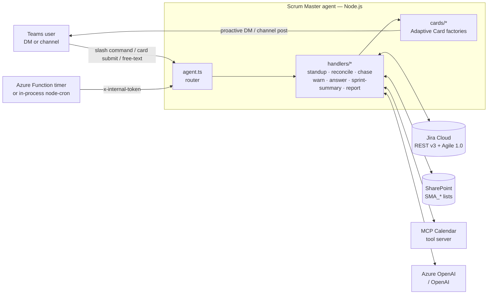

# Scrum Master autopilot — Agent 365 scenario sample (Node.js)

An autonomous **Scrum Master** built on the [Microsoft Agent 365 SDK](https://github.com/microsoft/Agent365-nodejs) that runs a scrum team's ceremonies end-to-end: daily standups, board reconciliation, blocker chase, mid-sprint risk warnings, grounded Q&A, and the sprint close report — all as proactive Adaptive Card conversations in Microsoft Teams. This is a **scenario extension** on top of the base [OpenAI + Node.js sample-agent](../../nodejs/openai/sample-agent); see that folder for A365 SDK primer material (user identity, install events, typing indicators).

> **Stack:** Node.js · TypeScript · Microsoft Agent 365 SDK · OpenAI Agents SDK · Jira Cloud REST v3 + Agile 1.0 · Microsoft Graph (delegated) · MCP Calendar tools · Adaptive Cards.

## What it does

Seven capabilities, each a handler under [`src/handlers/`](src/handlers). All of them use proactive DMs, single-source-of-truth state in SharePoint, and grounded tool calls into Jira — no hallucinated status.

1. **Standup** — Proactively DMs every squad member an Adaptive Card listing their sprint tasks with an update field and blocker toggle. Aggregates responses into a summary card posted to the configured channel. See [`handlers/standup.ts`](src/handlers/standup.ts).
2. **Board reconciliation** — A deterministic phrase classifier reads each update, maps it to a Jira status, and either auto-applies safe forward transitions or DMs the Scrum Master an approval card for ambiguous moves. See [`handlers/reconcile.ts`](src/handlers/reconcile.ts).
3. **Blocker chase** — When someone flags a blocker, the agent matches a subject-matter expert from the helper roster, calls the MCP Calendar tool for open slots, and books an unblock meeting on its own mailbox with the SM + owner + reporter as attendees. See [`handlers/chase.ts`](src/handlers/chase.ts).
4. **Sprint risk warn** — Nightly check: if the sprint is past the halfway mark and too many points are still in "To Do", DMs the SM with a risk assessment. See [`handlers/warn.ts`](src/handlers/warn.ts).
5. **Grounded Q&A** — Free-text questions ("what's the status of Task-14?", "latest update on Task-6?") go to a scenario-specific OpenAI Agent whose tools call live Jira. Per-user rolling history so follow-ups resolve against the last discussed task. See [`handlers/answer.ts`](src/handlers/answer.ts).
6. **Mid-sprint RAG report** — Two days before sprint end, classifies every task Red/Amber/Green by due date and posts a prioritised risk table to the channel. See [`handlers/sprint-summary.ts`](src/handlers/sprint-summary.ts).
7. **Sprint close report** — On sprint end, auto-generates a management-ready summary (completed stories, deliverables, release notes, action items, metrics) and posts inline to the channel. See [`handlers/report.ts`](src/handlers/report.ts).

## Architecture



State lives in seven `SMA_*` SharePoint lists ([schema reference](docs/sharepoint-schema.md)). Jira is treated as the source of truth for issue state; the agent writes back via comments and transitions but never invents data. The MCP calendar server handles meeting creation on the agent's own mailbox so no delegated user calendar consent is required.

## Prerequisites

Fast path (mock mode): **only Node.js is required.** All external services can be skipped.

| Requirement | Needed for | Notes |
|---|---|---|
| **Node.js ≥ 18** | Everything | Any current LTS |
| **Azure OpenAI or OpenAI API key** | Q&A + calendar tool | `gpt-4o` recommended |
| Atlassian Cloud (free) | Live Jira mode | Skip if `JIRA_MODE=mock`. [Sign up](https://www.atlassian.com/software/jira/free) |
| Microsoft 365 dev tenant | Live SharePoint mode | Skip if you only exercise the Q&A path |
| Agent 365 CLI | Deploying to Teams | Not needed for local Playground testing |

## Quick start — mock mode (no external services)

Get from clone to a working demo in under 5 minutes. Uses the built-in mock Jira sprint in [`src/mock/jira-mock.ts`](src/mock/jira-mock.ts) — a mutable in-memory board that responds to transitions and comments the same way live Jira would.

```powershell
git clone https://github.com/microsoft/Agent365-Samples.git
cd Agent365-Samples/scenarios/scrum-master

cp .env.template .env
# Edit .env: set AZURE_OPENAI_* (or OPENAI_API_KEY), leave JIRA_MODE=mock.

npm install
npm run dev
```

In another terminal:

```powershell
npm run test-tool     # opens the Agents Playground
```

In the Playground, DM the agent `/standup`. The agent will DM a standup card for the mock sprint. Fill in an update, click **Submit**, and watch the summary card land. Then try:

- `What's the status of Task-1?` — grounded Q&A over the mock board
- `What's blocking Task-6?` — inspects the mock blocker
- `/help` — full command list

## Full setup — live mode

For a real Jira + Teams demo. Approximately 20-30 minutes end-to-end.

### 1. Configure Jira

1. [Sign up for a free Atlassian Cloud site](https://www.atlassian.com/software/jira/free).
2. Create a Scrum project (any template). Note the **project key** (e.g. `DEMO`) shown next to the project name.
3. Note the **board id** — it's the number in the board URL, e.g. `.../jira/software/projects/DEMO/boards/1` → `1`.
4. [Create a Jira API token](https://id.atlassian.com/manage-profile/security/api-tokens).

### 2. Configure SharePoint

Pick any SharePoint site your account can write to (a dev-tenant OneDrive-linked site is fine). The setup script will provision the lists into a `SMA_` namespace — it will never touch existing content on that site.

### 3. Fill `.env`

```powershell
cp .env.template .env
```

Then edit — at minimum:

```bash
AZURE_OPENAI_API_KEY=...
AZURE_OPENAI_ENDPOINT=https://<your-resource>.services.ai.azure.com
AZURE_OPENAI_DEPLOYMENT=gpt-4o

JIRA_MODE=live
JIRA_BASE_URL=https://<your-org>.atlassian.net
JIRA_EMAIL=<your-atlassian-account-email>
JIRA_API_TOKEN=<paste-token>
JIRA_PROJECT_KEY=DEMO
JIRA_BOARD_ID=1

SHAREPOINT_SITE_URL=https://<your-tenant>.sharepoint.com/sites/<your-site>
INTERNAL_TRIGGER_TOKEN=<any-random-string>
```

Full var reference below.

### 4. Provision & seed

```powershell
npm install

# Signs in via device code (Microsoft Graph delegated). Creates the 7 SMA_*
# lists + SprintReports library. Idempotent.
npm run setup:sharepoint

# Seed the SMA_TeamMembers list from src/scripts/team.sample.json.
# Edit that file first to insert real AAD Object Ids + Jira accountIds for
# your squad, or accept the four Alice/Bob/Charlie/Dana placeholders.
npm run seed

# Seed SMA_HelperRoster (subject-matter experts for the blocker chase flow).
npm run seed:helpers

# Optional: create 2 stories + 5 sub-tasks + 1 future sprint on your Jira
# project. Skip if you already have real sprint data.
npm run seed:jira
```

If you ran `npm run seed:jira`, open your Jira board and click **Start sprint** on the newly-created sprint before continuing.

### 5. Run

```powershell
npm run dev
```

In another terminal, either connect via the Agents Playground:

```powershell
npm run test-tool
```

Or hire the agent inside your Teams tenant using the manifest in [`manifest/`](manifest) — see the [Configure Agent Testing guide](https://learn.microsoft.com/en-us/microsoft-agent-365/developer/testing?tabs=nodejs) for the full teams-side flow.

## Try each capability

Slash commands and free-text go to the agent DM. Card actions come back as follow-up DMs or channel posts.

| Capability | How to trigger | Expected behaviour | Handler |
|---|---|---|---|
| Standup | `/standup` | Card DMs to every roster member; summary card in channel after all responses. | [`standup.ts`](src/handlers/standup.ts) |
| Reconcile | Submit a standup update mentioning "PR is up" / "merged" / "started" | Safe transitions auto-apply with a Jira comment; ambiguous ones DM an approval card to the SM. | [`reconcile.ts`](src/handlers/reconcile.ts) |
| Chase | Toggle the blocker switch on a standup card and add text | SM gets a blocker card → click **Propose unblock meeting** → SME matched → click **Book it**. | [`chase.ts`](src/handlers/chase.ts) |
| Warn | `POST /api/internal/nightly-check?force=warn&forceAlert=true` | SM gets a risk-alert DM (`forceAlert` bypasses the threshold gate for demos). | [`warn.ts`](src/handlers/warn.ts) |
| Q&A | `What's the status of Task-1?` in a DM | Grounded reply with assignee, story points, link. Follow up with `provide more details` — it remembers the task. | [`answer.ts`](src/handlers/answer.ts) |
| Mid-sprint RAG | `POST /api/internal/sprint-summary?force=true` | Red/Amber/Green table posted to the configured channel. | [`sprint-summary.ts`](src/handlers/sprint-summary.ts) |
| Sprint close | `POST /api/internal/nightly-check?force=report` | Management-ready markdown report posted to the channel. | [`report.ts`](src/handlers/report.ts) |

Point the channel at the right place with `/config channel` from **inside** a Teams channel — captures its conversation reference so all downstream summaries and reports post there instead of the SM's DM.

## Configuration reference

Every scenario-specific env var — see [`.env.template`](.env.template) for the full list including base-sample vars.

| Variable | Default | Required for | Description |
|---|---|---|---|
| `JIRA_MODE` | `mock` | Everything | `mock` runs offline; `live` calls Atlassian. |
| `JIRA_BASE_URL` | *(none)* | live | `https://<org>.atlassian.net` |
| `JIRA_EMAIL` | *(none)* | live | Atlassian account email |
| `JIRA_API_TOKEN` | *(none)* | live | Personal API token |
| `JIRA_PROJECT_KEY` | *(none)* | live | Project key, e.g. `DEMO` |
| `JIRA_BOARD_ID` | *(none)* | live | Numeric board id |
| `SHAREPOINT_SITE_URL` | *(none)* | live | Site that hosts all `SMA_*` lists |
| `SHAREPOINT_LISTS_PREFIX` | `SMA_` | live | Namespace prefix on every list |
| `GRAPH_TENANT_ID` | `common` | live | Set to a single tenant guid to pin the sign-in |
| `GRAPH_CLIENT_ID` | *(none)* | live | Public-client app id. `14d82eec-204b-4c2f-b7e8-296a70dab67e` (Microsoft Graph CLI) works on most tenants without additional consent. |
| `STANDUP_CRON` | `0 30 3 * * 1-5` | Local scheduler | UTC cron — default = 09:00 IST weekdays |
| `NIGHTLY_CRON` | `0 0 19 * * *` | Local scheduler | UTC cron — default = 00:30 IST daily |
| `STANDUP_CUTOFF_HOURS` | `4` | Standup | Give people this long to respond before the summary posts anyway |
| `TIMEZONE` | `Asia/Kolkata` | Display only | Used in card date rendering |
| `WARN_TODO_PCT` | `0.40` | Warn | Trip if this fraction of committed points is still `To Do` |
| `WARN_SPRINT_PROGRESS_PCT` | `0.50` | Warn | Trip only after this fraction of sprint duration has elapsed |
| `LOCAL_CRON` | `true` | Dev | Set `false` in prod once Azure Function timers are wired up |
| `INTERNAL_TRIGGER_TOKEN` | *(none)* | Timer endpoints | Shared secret in the `x-internal-token` header |

## Internal HTTP endpoints

All three are guarded by the `x-internal-token` header (must match `INTERNAL_TRIGGER_TOKEN`) and are designed for the Azure Function timers in the sibling [`azure-functions/`](azure-functions) folder — but curl-safe for demos.

### `POST /api/internal/standup-trigger`

Fires today's standup. Idempotent per calendar day.

```powershell
Invoke-RestMethod -Method Post `
  -Uri 'http://localhost:3978/api/internal/standup-trigger' `
  -Headers @{ 'x-internal-token' = '<INTERNAL_TRIGGER_TOKEN>'; 'content-type' = 'application/json' } `
  -Body '{}'
```

Response: `{ "standupId": "1#2026-07-12", "sentTo": 4, "skipped": 0 }`

### `POST /api/internal/nightly-check`

Runs the **Warn** check and, if the sprint has ended, the **Sprint close report**.

Query params:
- `force=warn` — Warn only
- `force=report` — Report only, bypasses the "sprint has ended" gate
- `sprintId=<n>` — Override the auto-detected active sprint
- `forceAlert=true` — Make Warn DM the SM regardless of thresholds (demo aid)

### `POST /api/internal/sprint-summary`

Fires the mid-sprint RAG report to the configured channel.

Query params:
- `force=true` — bypass the "T-2 days from sprint end" gate

## Reconcile rules

Free-text updates are classified in [`handlers/reconcile.ts`](src/handlers/reconcile.ts). First rule to match wins.

| Target | Trigger patterns (case-insensitive) |
|---|---|
| `Done` | `done`, `completed`, `finished`, `merged`, `shipped`, `deployed`, `closed`, `ready to close` |
| `In Review` | `in review`, `code review`, `pr up`, `pull request`, `reviewing`, `waiting for/on review` |
| `In Progress` | `started`, `starting`, `began`, `beginning`, `kicked off`, `working on`, `in progress`, `picked up`, `am/i'm/now implementing/building/coding/writing` |

A blocker toggle on any item forces `unchanged`. Any status difference that maps to a **safe forward step** on `To Do → In Progress → In Review → Done` is auto-applied; anything else (backwards, skip, ambiguous) becomes a confirm card DM to the SM.

## Warn thresholds

Sprint is flagged **at risk** when both hold:

```
progressPct         >= WARN_SPRINT_PROGRESS_PCT     (default 0.50)
pointsInToDo / total >= WARN_TODO_PCT               (default 0.40)
```

If story points are missing on any issue, the check falls back to item counts.

## Calendar path

**Propose unblock meeting** and **Book it** on the Adaptive Cards drive the A365 `mcp_CalendarTools` MCP server via a scenario-specific OpenAI Agent whose output is Zod-validated. The event is created on the **agent's own** mailbox; SM plus blocker owner + reporter are attached as attendees and receive Teams meeting invitations. No delegated user calendar consent is required.

Fallback: if `findMeetingTimes` yields no candidates, the code synthesizes three consecutive hour slots so the demo still moves forward.

## File layout

```
scenarios/scrum-master/
├─ README.md                       (this file)
├─ AGENT-CODE-WALKTHROUGH.md       file-by-file source tour
├─ .env.template                   env var template
├─ package.json                    scripts: dev · build · test-tool · setup:sharepoint · seed · seed:helpers · seed:jira
├─ a365.config.json                Agent 365 CLI config
├─ manifest/                       Teams app + agentic-user templates
├─ docs/
│  ├─ sharepoint-schema.md         reference for every SMA_* list column
│  └─ design.md                    architecture notes
├─ src/
│  ├─ index.ts                     Express server, JWT + internal-token routes
│  ├─ agent.ts                     activity router — commands, card submits, free-text
│  ├─ config.ts                    typed env-var reader
│  ├─ openai-config.ts             Azure/OpenAI client factory
│  ├─ handlers/                    the 7 capabilities (see "What it does" above)
│  ├─ cards/                       Adaptive Card factories
│  ├─ services/
│  │  ├─ jira.ts                   Jira REST + Agile 1.0 wrapper (live)
│  │  ├─ jira-tool.ts              OpenAI Agents tools for Q&A
│  │  ├─ issue-labels.ts           Task-N ↔ PROJ-N label translation
│  │  ├─ graph.ts                  MSAL device-code + delegated Graph
│  │  ├─ sharepoint.ts             list/library CRUD + LIST_SCHEMAS
│  │  ├─ team-roster.ts            SMA_TeamMembers cached wrapper
│  │  ├─ helperMatcher.ts          keyword matching for the chase flow
│  │  ├─ session-store.ts          in-memory session cache
│  │  ├─ proactive.ts              adapter.continueConversation wrapper
│  │  └─ calendar.ts               MCP Calendar client
│  ├─ cron/local-scheduler.ts      node-cron (dev only)
│  ├─ mock/jira-mock.ts            offline seeded sprint for JIRA_MODE=mock
│  └─ scripts/
│     ├─ setup-sharepoint.ts       provisions site collateral
│     ├─ seed-team.ts              seeds SMA_TeamMembers
│     ├─ seed-helper-roster.ts     seeds SMA_HelperRoster
│     ├─ seed-jira-sample.ts       optional: seeds Jira with sample stories
│     ├─ team.sample.json          personas topology
│     └─ sprint.sample.json        Jira seed topology
└─ azure-functions/                sibling package: nightly + mid-sprint timers
```

## SharePoint schema

Full reference: [`docs/sharepoint-schema.md`](docs/sharepoint-schema.md).

Source of truth: `LIST_SCHEMAS` in [`src/services/sharepoint.ts`](src/services/sharepoint.ts).

## Reset the demo

```powershell
Remove-Item .mstoken-cache.json      # force a fresh device-code sign-in
# Empty the SMA_* lists via SharePoint UI (Site contents → each list → delete all items)
# or delete the lists entirely and re-run `npm run setup:sharepoint`.
```

To reset Jira sprint issues, use the Atlassian UI or `POST /rest/agile/1.0/sprint/{sprintId}/issue`.

## Known limitations

- **MSAL token cache is unencrypted on disk** (`.mstoken-cache.json`, git-ignored). Fine for local dev; swap for Key Vault or a DPAPI-backed extension in production.
- **`GRAPH_CLIENT_ID` defaults to the well-known "Microsoft Graph Command Line Tools" public client** for zero-setup device-code sign-in. Register your own multi-tenant public client for a real deployment.
- **Single-team by design.** The sample assumes one scrum team per process (single project key, single board, single channel). Multi-team support (per-team config, isolated Jira credentials, sharded timers) is called out as future work in [`docs/design.md`](docs/design.md).
- **Proactive DMs require prior interaction.** Every squad member must have said "hi" to the agent at least once so their conversation reference is captured in `SMA_TeamMembers`. `upsertConversationReference` populates it on every incoming activity.
- **Running local `node-cron` and Azure Function timers simultaneously is safe** (`standupId = <sprintId>#<yyyy-mm-dd>` provides idempotency) but does two Jira reads per tick. Set `LOCAL_CRON=false` once the Function is deployed.

## Support

- Issues, questions, feedback: [GitHub Issues](https://github.com/microsoft/Agent365-Samples/issues)
- SDK docs: [Microsoft Agent 365 Developer documentation](https://learn.microsoft.com/en-us/microsoft-agent-365/developer/)
- Security: see the repo-root [`SECURITY.md`](../../SECURITY.md)

## Contributing

This project welcomes contributions and suggestions. Most contributions require you to agree to a Contributor License Agreement (CLA) declaring that you have the right to, and actually do, grant us the rights to use your contribution. For details, visit <https://cla.opensource.microsoft.com>.

When you submit a pull request, a CLA bot will automatically determine whether you need to provide a CLA and decorate the PR appropriately (e.g., status check, comment). Simply follow the instructions provided by the bot. You will only need to do this once across all repos using our CLA.

This project has adopted the [Microsoft Open Source Code of Conduct](https://opensource.microsoft.com/codeofconduct/). For more information see the [Code of Conduct FAQ](https://opensource.microsoft.com/codeofconduct/faq/) or contact [opencode@microsoft.com](mailto:opencode@microsoft.com).

## Trademarks

*Microsoft, Windows, Microsoft Azure and/or other Microsoft products and services referenced in the documentation may be either trademarks or registered trademarks of Microsoft in the United States and/or other countries. The licenses for this project do not grant you rights to use any Microsoft names, logos, or trademarks. Microsoft's general trademark guidelines can be found at <http://go.microsoft.com/fwlink/?LinkID=254653>.*

## License

Copyright (c) Microsoft Corporation. All rights reserved.

Licensed under the MIT License — see the repo-root [`LICENSE.md`](../../LICENSE.md) for details.
