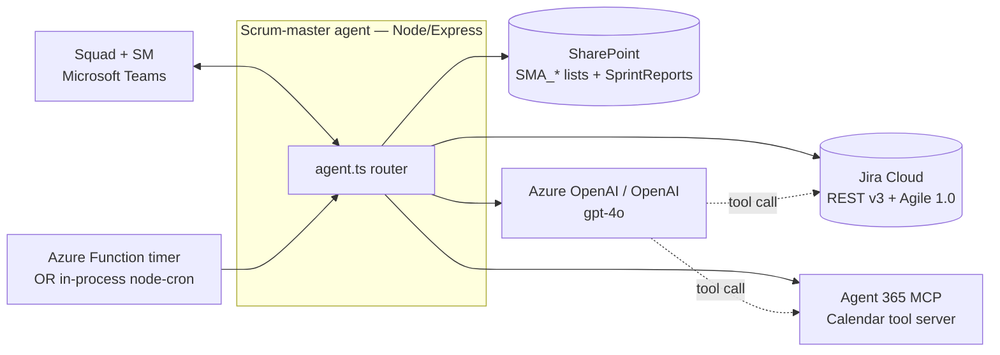
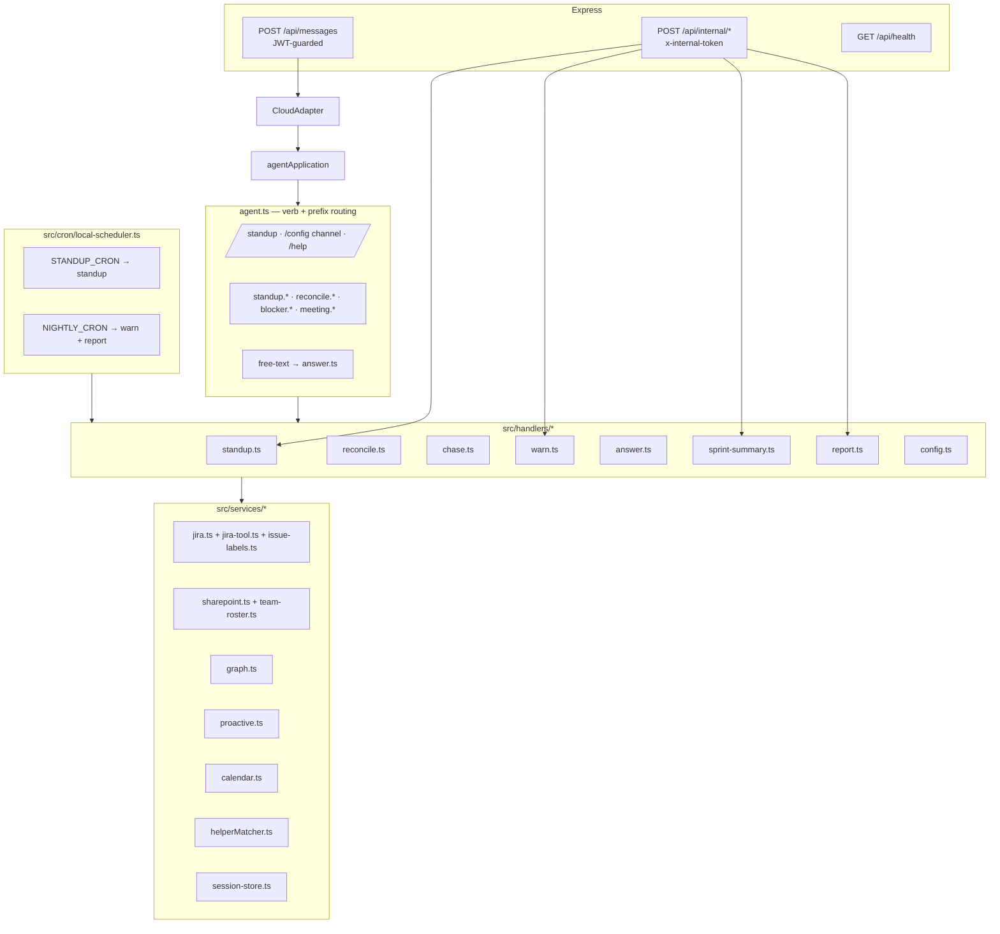
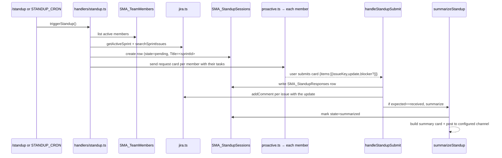
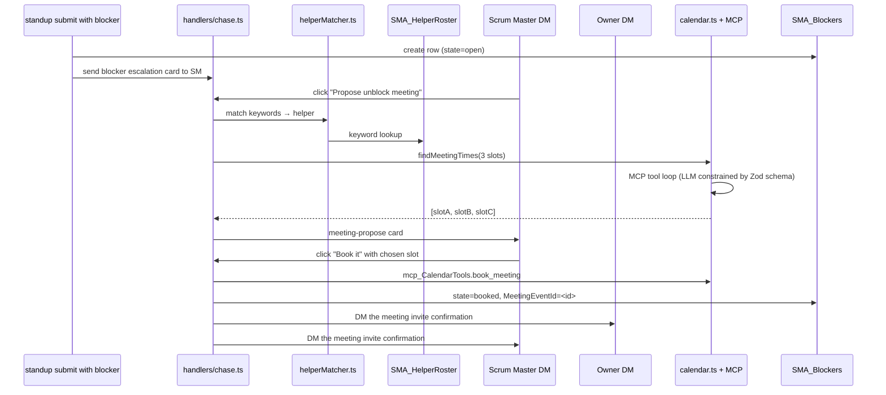
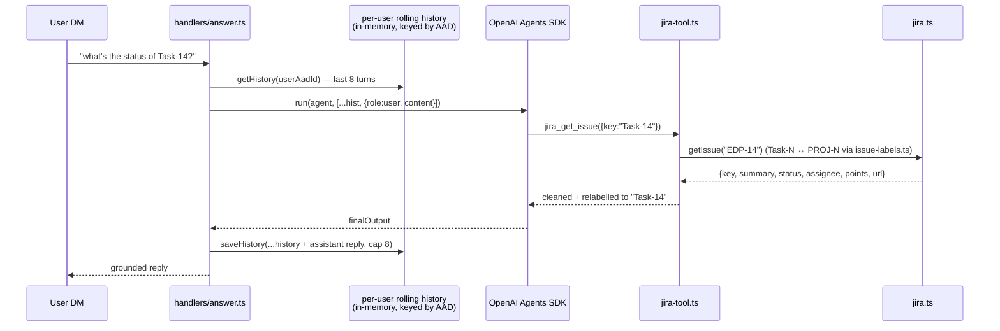

# Scrum Master autopilot — Design

Architecture, per-flow sequences, module responsibilities, and extension
points for the `scrum-master` scenario sample.

> 🔧 For setup and operational instructions, see [`../README.md`](../README.md).

## Contents

1. [Design principles](#1-design-principles)
2. [System context](#2-system-context)
3. [High-level component diagram](#3-high-level-component-diagram)
4. [Runtime model](#4-runtime-model)
5. [The seven flows](#5-the-seven-flows)
6. [Data model](#6-data-model)
7. [Auth model — delegated Graph only](#7-auth-model--delegated-graph-only)
8. [Determinism boundary — where the LLM lives](#8-determinism-boundary--where-the-llm-lives)
9. [Concurrency, idempotency, and dedup](#9-concurrency-idempotency-and-dedup)
10. [Observability](#10-observability)
11. [Extension points](#11-extension-points)
12. [Known limitations + hardening roadmap](#12-known-limitations--hardening-roadmap)

---

## 1. Design principles

Every design decision below reflects one or more of these six principles:

1. **Deterministic-first.** Everything a Scrum Master depends on (which
   transition to apply, when to warn, which helper to match, what a report
   contains) is TypeScript, not the LLM. LLM calls are gated to the two
   places where language understanding is genuinely required: free-text
   Q&A (`answer.ts`) and the MCP calendar tool loop (`calendar.ts`).
2. **Card actions must never double-fire.** Teams and the A365 platform
   enforce a short SLA on card-shaped Invoke and Message activities. Every
   card handler sends an immediate ack (`Booking the meeting…`) and runs
   the heavy work in `setImmediate` so the invoke response lands inside
   the platform's ~15 s timeout.
3. **Graceful degradation, never a crash.** Every scheduled path is wrapped
   in `try/catch`; process-level `unhandledRejection` /
   `uncaughtException` handlers ([`index.ts`](../src/index.ts)) keep the
   server alive even if the connector 502s on an outbound Activity.
4. **One path to Graph.** Every Graph call uses a delegated device-code
   token cached to `.mstoken-cache.json`. No application-permission
   client secret is needed. Provisioning and runtime use the same
   `GRAPH_SCOPES`. See §7.
5. **Durable state in SharePoint.** All persistent state lives in seven
   `SMA_*` lists (see [`sharepoint-schema.md`](./sharepoint-schema.md)).
   Restarts recover cleanly. Only the fast per-turn cache in
   `session-store.ts` is in-memory.
6. **Jira is the source of truth for issue state.** The agent writes back
   via comments and transitions but never invents data. Every LLM reply is
   grounded through a Jira tool call — no hallucinated status.

## 2. System context



- **Users** interact only through Teams (DM and channel).
- **Jira Cloud** is the source of truth for issue state; the agent writes
  comments + transitions.
- **SharePoint** is the source of truth for scenario-specific state
  (roster, standup sessions, blockers, helpers) via delegated Graph.
- **MCP Calendar** creates the unblock meeting on the agent's own mailbox
  so no delegated user-calendar consent is required.
- **LLM** is used for grounded Q&A and MCP tool loops only.

## 3. High-level component diagram



The scheduler shares **state** (SharePoint lists + `session-store`) with the
message handlers but not code. They only touch each other through those stores.

## 4. Runtime model

### 4.1 Boot sequence

`src/index.ts` runs, in order:

1. `configDotenv()` — populate `process.env`.
2. `installHttpLogging()` — global axios tracer, no-op when `LOG_HTTP=false`.
3. `printStartupBanner()` — one-shot config summary so misconfig is loud.
4. Register `unhandledRejection` + `uncaughtException` process handlers.
5. Import `agent.ts` (which wires the router and starts `local-scheduler`).
6. Mount `/api/health` (unauthenticated), `/api/internal/*` (shared-secret
   guarded), then the JWT middleware, then `/api/messages`.
7. Bind to `PORT` (default `3978`).

### 4.2 Every user turn

1. Teams POSTs an Activity to `/api/messages`.
2. `authorizeJWT` validates the token.
3. `CloudAdapter.process` unpacks the activity, calls `agentApplication.run(context)`.
4. The router in [`agent.ts`](../src/agent.ts):
   - Captures the sender's `ConversationReference` into
     `SMA_TeamMembers.ConversationRef` (idempotent), so future proactive
     DMs can reach them.
   - Sniffs whether the activity is a card submit (`activity.value.action`).
   - If **card submit** → routes by `action` prefix (`standup.*`,
     `reconcile.*`, `blocker.*`, `meeting.*`).
   - If **slash command** → routes to
     [`handlers/commands.ts`](../src/handlers/commands.ts).
   - Otherwise → free-text goes to
     [`handlers/answer.ts`](../src/handlers/answer.ts) for grounded Q&A.

### 4.3 Every scheduled tick

`local-scheduler.ts` fires `node-cron` jobs (dev only — set `LOCAL_CRON=false`
in prod and use the sibling `azure-functions/` package). Each cron callback
hits the same handler as the equivalent internal HTTP endpoint, so the two
paths are behaviourally equivalent and share idempotency guards.

## 5. The seven flows

### 5.1 Standup (MVP 1)



Standup id = `<sprintId>#<yyyy-mm-dd>` — the natural idempotency key.
Running the flow twice on the same day is a no-op.

### 5.2 Reconcile (MVP 2)

Free-text updates are classified by a deterministic phrase table in
[`handlers/reconcile.ts`](../src/handlers/reconcile.ts). First rule to match wins.

| Target | Trigger patterns (case-insensitive) |
|---|---|
| `Done` | `done`, `completed`, `finished`, `merged`, `shipped`, `deployed`, `closed`, `ready to close` |
| `In Review` | `in review`, `code review`, `pr up`, `pull request`, `reviewing`, `waiting for/on review` |
| `In Progress` | `started`, `starting`, `began`, `beginning`, `kicked off`, `working on`, `in progress`, `picked up`, `am/i'm/now implementing/building/coding/writing` |

A blocker toggle on any item forces `unchanged`. Any classifier output that
maps to a **safe forward step** on `To Do → In Progress → In Review → Done`
auto-applies. Anything else (backwards, skip, ambiguous) becomes a confirm
card DM to the SM, who approves per-row and clicks **Apply approved**. The
LLM is *not* involved in reconcile — a demo run has 100 % deterministic
behaviour on this path.

### 5.3 Chase (MVP 3)



The event is created on the **agent's own** mailbox; SM + owner + reporter
are attached as attendees and receive Teams meeting invitations. No
delegated user-calendar consent is required.

Fallback: if `findMeetingTimes` yields no candidates, the code synthesizes
three consecutive hour slots so the demo still moves forward.

### 5.4 Warn (MVP 4)

`handlers/warn.ts` is called by `NIGHTLY_CRON` (or the internal
`nightly-check` endpoint). Sprint is flagged **at risk** when both hold:

```
progressPct         >= WARN_SPRINT_PROGRESS_PCT     (default 0.50)
pointsInToDo / total >= WARN_TODO_PCT               (default 0.40)
```

If story points are missing on any issue, the check falls back to item
counts. Every firing writes a row to `SMA_SprintRisks` (idempotency key =
`<sprintId>#<yyyy-mm-dd>`) so the same sprint can't be re-alerted the same
day.

### 5.5 Answer (MVP 5)



Tools available to the agent: `jira_get_issue`, `jira_list_sprint_issues`,
`jira_get_issue_comments`. The per-user rolling history means follow-ups
like *"provide more details"* or *"and the assignee?"* resolve against
the last discussed task — no need to repeat the key.

### 5.6 Mid-sprint RAG (MVP 6)

`handlers/sprint-summary.ts` is called by the internal
`sprint-summary?force=true` endpoint (or the T-2 timer). Every task is
classified:

- **RED** — `dueDate < today` and status not `Done`
- **AMBER** — `dueDate <= today + AMBER_WINDOW_DAYS` and status not
  `Done`/`In Review`
- **GREEN** — otherwise

The output is a prioritised markdown table posted inline to the configured
channel — no attachments, no SharePoint upload.

### 5.7 Sprint close (MVP 7)

`handlers/report.ts` builds a management-ready markdown message
(completed user stories, deliverables, deployments, demo highlights,
release notes, action items table, sprint metrics table) and posts it
inline to the channel. Idempotency key = `<sprintId>` on the
`SMA_SprintSessions` row.

## 6. Data model

All persistent state lives in SharePoint. Complete column-level reference:
[`sharepoint-schema.md`](./sharepoint-schema.md). Summary:

| List | Purpose | Idempotency key |
|---|---|---|
| `SMA_TeamMembers` | Roster | `AadObjectId` |
| `SMA_TeamsConfig` | Configured channel per team | `TeamId#ChannelId` |
| `SMA_StandupSessions` | One row per standup run | `<sprintId>#<date>` |
| `SMA_StandupResponses` | One row per (standup, user) | `<StandupId>#<UserAadId>` |
| `SMA_Blockers` | One row per flagged blocker | `<StandupId>#<issueKey>` |
| `SMA_SprintRisks` | One row per Warn firing | `<sprintId>#<date>` |
| `SMA_HelperRoster` | SME topics for chase | `Title` (topic) |

## 7. Auth model — delegated Graph only

- **Microsoft Graph (SharePoint + user lookup)** — MSAL device-code flow
  in [`services/graph.ts`](../src/services/graph.ts), scopes
  `Sites.ReadWrite.All`, `Sites.Manage.All`, `Files.ReadWrite.All`,
  `User.Read`, `offline_access`. Tokens cached to `.mstoken-cache.json`.
  `GRAPH_CLIENT_ID` defaults to the well-known **Microsoft Graph Command
  Line Tools** public client id, which is pre-consented on most tenants —
  zero-registration onboarding. Register your own multi-tenant public
  client for a real deployment.
- **Jira Cloud** — Basic auth with `email:apiToken`. Token from
  [id.atlassian.com/manage-profile/security/api-tokens](https://id.atlassian.com/manage-profile/security/api-tokens).
- **Azure OpenAI / OpenAI** — API key from `.env`.
- **MCP Calendar** — Agent 365 platform provides the identity; the sample
  wraps it through [`services/calendar.ts`](../src/services/calendar.ts).

**No application-permission Graph client.** Everything a user touches
they touch as themselves. Adding application permissions was intentionally
avoided to keep the onboarding story to a single device-code sign-in and
no admin consent.

## 8. Determinism boundary — where the LLM lives

| Path | LLM? | Why |
|---|---|---|
| Standup card generation | No | Card is templated from Jira sprint data |
| Reconcile classifier | No | Keyword regex table |
| Chase — helper matching | No | Keyword regex over `SMA_HelperRoster` |
| Chase — calendar tool loop | Yes | MCP tools invoked by LLM; output Zod-validated |
| Warn thresholds | No | Pure arithmetic on sprint state |
| Q&A (Answer) | Yes | Free-text intent + tool selection |
| Mid-sprint RAG | No | Rule-based due-date classifier |
| Sprint close report | No | Deterministic markdown template over Jira data |

The two LLM paths (Chase calendar, Q&A) are the only places where behaviour
depends on model output. Everything else is TypeScript.

## 9. Concurrency, idempotency, and dedup

- **Card submits use fire-and-forget** — handler acks in <200 ms via
  `context.sendActivity('working on it…')`, downstream work runs via
  `setImmediate`. Follow-ups arrive as proactive DMs against the cached
  conversation reference.
- **Every scheduled path is idempotent by natural key.**
  - Standup — `<sprintId>#<yyyy-mm-dd>`
  - Warn — same
  - Blocker — `<StandupId>#<issueKey>`
- **Running `local-scheduler` and Azure Function timers simultaneously is
  safe** but wasteful (two Jira reads per tick). Set `LOCAL_CRON=false`
  when Functions are deployed.
- **Session cache** in `session-store.ts` is in-memory. A restart mid-standup
  drops the pending session; the standup row in `SMA_StandupSessions`
  still exists but requires a manual re-post via
  `POST /api/internal/standup-trigger`. See §12.

## 10. Observability

- **Startup banner** — [`src/startup-check.ts`](../src/startup-check.ts)
  prints a one-shot config summary at boot with `[MISSING]` markers for
  unset vars. Runs before any handler is imported.
- **Level-based logger** — [`src/util/logger.ts`](../src/util/logger.ts)
  gates output by `LOG_LEVEL` (`error|warn|info|debug|trace`), tags every
  line with a scope + timestamp, and redacts credential-shaped values.
- **HTTP tracing** — [`src/util/httpLogger.ts`](../src/util/httpLogger.ts)
  hooks a global axios interceptor when `LOG_HTTP=true`, printing
  `method host path status latency` for every outbound Jira / Graph /
  MCP call. Off by default — production noise otherwise.
- **Process safety nets** — `unhandledRejection` and `uncaughtException`
  handlers in `index.ts` log and continue. Scheduler survives Graph 502s.
- **Agent 365 observability** — the base sample enables the A365
  observability exporter via `ENABLE_A365_OBSERVABILITY_EXPORTER`. This
  scenario inherits that path unchanged.

## 11. Extension points

- **Add a new slash command** — extend `SlashCommand` union in
  [`handlers/commands.ts`](../src/handlers/commands.ts) and the switch it
  dispatches from. The router will pick it up automatically.
- **Add a new card action** — pick a prefix (e.g. `retro.*`), add the
  handler in `src/handlers/retro.ts`, and register the prefix in the
  router in [`src/agent.ts`](../src/agent.ts).
- **Swap the Jira backend** — implement `JiraClient` from
  [`services/jira.ts`](../src/services/jira.ts) against a different
  tracker. `getJiraClient()` picks live vs mock via `JIRA_MODE`.
- **Add a new Q&A tool** — export a `tool({name, description, parameters,
  execute})` from [`services/jira-tool.ts`](../src/services/jira-tool.ts)
  and append it to `JIRA_TOOLS`. The Answer prompt will notice it after
  a restart.
- **Multi-team** — add a `TeamId` column to every list and thread it
  through `resolveTeamContext(userAadId)`. See §12.

## 12. Known limitations + hardening roadmap

- **Single team per process.** One project key + one board + one channel.
  Multi-team support requires a `SMA_Teams` list, a `TeamId` column on
  every existing list, and per-team Jira credentials in Key Vault. Sketch
  is in the README under "Known limitations".
- **In-memory session cache.** A nodemon restart mid-standup requires a
  manual re-fire. Fix: swap `session-store.ts` for a SharePoint-backed
  store, keyed by `standupId`.
- **`.mstoken-cache.json` is unencrypted.** Fine for local dev; swap for
  Key Vault or a DPAPI-backed extension in production.
- **`GRAPH_CLIENT_ID` uses the shared "Microsoft Graph Command Line Tools"
  public client.** Zero-setup, but production deployments should register
  their own multi-tenant public client.
- **No zod validation on Q&A LLM output.** Currently trusts `result.finalOutput`
  as a string. Cheap fix — wrap the return in a `z.string().min(1)` guard.
- **`GRAPH_TENANT_ID=common` allows any tenant to sign in.** Pin to a
  single tenant guid in `.env` for a locked-down deployment.
- **Proactive DMs require prior interaction** — every member must have
  said "hi" to the agent at least once so their `ConversationReference`
  is captured in `SMA_TeamMembers`. Bootstrap via an installation event
  (currently no-op) once A365 supports proactive-first messaging.
